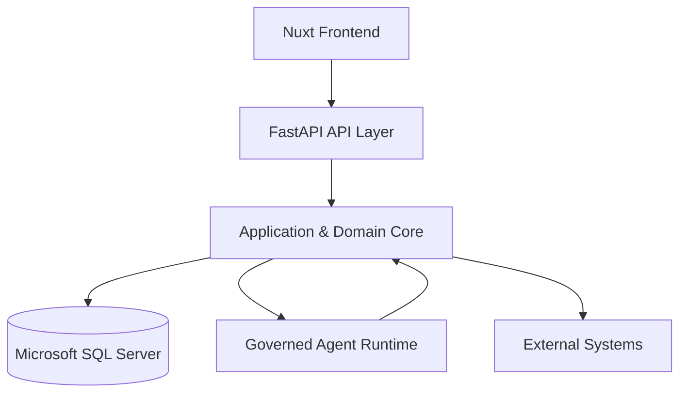

# Technical Debt Intelligence & Governance

Technical Debt Intelligence & Governance is a proof-of-concept platform for identifying, investigating, validating, and governing technical debt across multiple technical and operational sources.

The platform brings together technical signals, supporting evidence, enterprise context, AI-assisted investigation, human decisions, policy controls, and external action execution in one traceable workflow.

> **Core principle:** Deterministic components establish facts. AI investigates and recommends. Humans decide. Policies control authority. Executors perform approved actions.

---

## Why This Project Exists

Technical debt in a large organization is rarely visible in a single system.

A potential problem may appear as:

- a static code analysis finding,
- a recurring operational incident,
- an outdated dependency,
- a Git history observation,
- an architectural standard violation,
- or another technical or operational signal.

These observations are useful, but:

> **A signal is not automatically technical debt.**

A signal must first be connected to the affected system, supported by evidence, enriched with enterprise context, investigated, and reviewed before it becomes a governed technical-debt record.

This project demonstrates how that process can be handled as an end-to-end system rather than as a collection of disconnected tool findings.

---

## End-to-End Flow

```mermaid
flowchart LR
    A[Technical & Operational Sources]
    B[Connectors / Ingestion]
    C[Normalized Signals]
    D[Evidence & Provenance]
    E[Candidate Technical Debt]
    F[Enterprise Context]
    G[AI Investigation]
    H[Human Validation]
    I[Technical Debt]
    J[Action Proposal]
    K[Human Approval]
    L[Policy Gate]
    M[External Executor]
    N[Verification]
    O[Audit Trail]

    A --> B
    B --> C
    C --> D
    D --> E
    F --> E
    E --> G
    G --> H
    H --> I
    I --> J
    J --> K
    K --> L
    L --> M
    M --> N
    N --> O
```



The workflow deliberately separates **finding**, **decision**, **authorization**, and **execution**.

An AI-generated recommendation cannot by itself validate technical debt, approve an action, bypass policy, or modify an external system.

---

## Core Concepts

| Concept | Meaning |
|---|---|
| **Signal** | A technical or operational observation that may indicate a potential problem. |
| **Evidence** | Information supporting a signal, candidate, investigation, or decision. |
| **Provenance** | The traceable record of where information originated and how it entered the system. |
| **Candidate** | A potential technical-debt item awaiting investigation and validation. |
| **Enterprise Asset** | An application, service, repository, or other managed technical asset. |
| **Enterprise Context** | Ownership, criticality, relationships, dependencies, and operational information surrounding an asset. |
| **Technical Debt** | A candidate that has passed the required validation and entered the governed lifecycle. |
| **Agent Investigation** | AI-assisted analysis performed using controlled context and explicitly allowed tools. |
| **Human Validation** | The authoritative decision that determines whether a candidate should become governed technical debt. |
| **Governed Action** | A proposed remediation or management action subject to approval and policy checks. |
| **Execution** | The controlled application of an approved action to an external system. |
| **Verification** | Confirmation that the requested external action actually produced the expected result. |
| **Audit Trail** | Persistent evidence of decisions, policy results, executions, and verification outcomes. |

Several distinctions are fundamental to the design:

```text
Signal              ≠ Technical Debt
Candidate           ≠ Validated Technical Debt
AI Recommendation   ≠ Human Decision
Human Approval      ≠ Policy Authorization
Execution Request   ≠ Verified Execution
```

---

## Current PoC Capabilities

The current PoC implements the main technical-debt governance flow from source observations through controlled external action execution.

### Signal and Evidence

- Multiple technical and operational signal sources
- Canonical signal normalization
- Evidence persistence
- Provenance preservation
- Duplicate-safe signal persistence
- Candidate correlation based on related observations

Implemented source scenarios include:

- Semgrep static-analysis findings
- Incident observations
- Dependency lifecycle / EOL findings
- Git-based self-admitted technical debt observations

A read-only GitHub Issues integration is also available as a reference connector for external-system integration.

### Enterprise Context

The system maintains a controlled enterprise model containing:

- applications,
- services,
- repositories,
- teams,
- asset ownership,
- asset relationships,
- dependencies,
- incidents,
- and asset criticality information.

This allows a technical finding to be evaluated in the context of the systems and teams affected by it.

### AI-Assisted Investigation

The governed agent runtime can investigate a candidate using explicitly registered read tools.

Available investigation capabilities include access to:

- signal evidence,
- dependency relationships,
- incident and enterprise context,
- architectural guidance,
- and related supporting information.

The agent produces a structured assessment rather than making an authoritative lifecycle decision.

The runtime includes controls for:

- allowed tools,
- tool schema validation,
- policy decisions,
- execution budgets,
- iteration limits,
- timeouts,
- stop reasons,
- missing evidence,
- conflicting evidence,
- and unsafe or unauthorized tool requests.

The current implementation includes an OpenAI-backed investigation provider behind an explicit provider boundary.

### Human Governance

Authorized users can review:

- candidate information,
- supporting signals,
- evidence,
- provenance,
- enterprise context,
- agent assessment,
- tool activity,
- policy results,
- grounding references,
- and uncertainty.

The human validation workflow keeps the final technical-debt decision outside the AI model.

### Governed Action Execution

Validated technical debt can progress into a controlled action workflow:

```text
Technical Debt
      ↓
Action Proposal
      ↓
Human Approval
      ↓
Policy Decision
      ↓
Execution
      ↓
Verification
      ↓
Audit
```

External writes are isolated behind executor boundaries.

The reference implementation supports governed GitHub Issue creation. The resulting external side effect is verified and reconciled before the workflow is considered complete.

---

## Architecture

The application uses an **extensible modular monolith**.

The system remains deployable as one application while maintaining explicit internal boundaries between major capabilities.



External dependencies are isolated behind explicit contracts such as:

- connectors,
- normalizers,
- agent tools,
- AI providers,
- policies,
- executors,
- and registries.

This allows new integrations to be introduced without coupling the core domain directly to a specific external technology.

More detailed architecture documentation is available under:

`docs/02-architecture/`

---

## Data and Database

Microsoft SQL Server acts as the persistent system of record for the PoC.

SQLAlchemy provides the application persistence mapping, while Alembic manages versioned database schema evolution.

At a conceptual level, the stored information follows the system lifecycle:

```text
Enterprise Assets
       │
       ├── Ownership
       ├── Relationships
       └── Incidents
              │
              ▼
Signals → Evidence
              │
              ▼
          Candidates
              │
              ▼
       Human Decisions
              │
              ▼
        Technical Debt
              │
              ▼
       Governed Actions
              │
              ▼
          Execution
              │
              ▼
        Verification
              │
              ▼
          Audit State
```

Database migrations define **how the schema evolves**.

Seed processes provide the **controlled enterprise and demonstration data** required to reproduce the PoC environment.

The synthetic estate is not intended to reproduce a production enterprise CMDB. It provides a stable environment for demonstrating asset relationships, ownership, incidents, dependencies, technical signals, and governance behavior without using production institutional data.

Detailed database documentation is available under:

`docs/03-data-and-database/`

---

## Technology Stack

### Backend

- Python 3.12
- FastAPI
- Pydantic
- SQLAlchemy 2
- Alembic
- Microsoft SQL Server

### Frontend

- Nuxt
- Vue
- TypeScript

### Analysis and Source Processing

- Semgrep
- PyDriller
- Controlled dependency lifecycle data
- Incident data

### AI

- Governed investigation runtime
- OpenAI-backed provider
- Structured tool calling
- Explicit provider boundary

### External Integration

- Extensible connector contracts
- Read-only GitHub reference integration
- Governed GitHub write executor
- Policy-controlled external execution

---

## Repository Structure

```text
technical-debt-intelligence-poc/
│
├── backend/              Backend application, domain and persistence
├── frontend/             Nuxt governance workspace
├── docs/                 Architecture and developer documentation
├── evaluation/           Ground-truth and evaluation assets
├── synthetic_sources/    Controlled external-source scenarios
├── README.md             Project entry point
└── AGENTS.md             Repository development instructions
```

Detailed repository navigation is documented in:

`docs/10-developer-guide/repository-structure.md`

---

## Documentation

The documentation is organized around the system itself rather than the order in which the PoC was developed.

For a first-time reader, the recommended path is:

1. `docs/01-overview/system-overview.md`
2. `docs/01-overview/end-to-end-flow.md`
3. `docs/01-overview/core-concepts.md`
4. `docs/02-architecture/system-architecture.md`
5. `docs/03-data-and-database/README.md`

After understanding the overall system, individual capabilities can be explored through:

```text
docs/
├── 01-overview/
├── 02-architecture/
├── 03-data-and-database/
├── 04-signal-and-evidence/
├── 05-enterprise-context/
├── 06-connectors-and-integrations/
├── 07-agent-intelligence/
├── 08-governance/
├── 09-api-and-frontend/
├── 10-developer-guide/
├── 11-evaluation/
├── 12-operations-and-handover/
├── 13-roadmap/
├── adr/
└── history/
```

`docs/README.md` provides the complete documentation map.

Historical implementation plans and development checkpoints are retained under `docs/history/` for traceability, but they are not the primary source of truth for the current system architecture.

---

## PoC Boundary

This repository demonstrates a **production-aware architecture**, not a production-ready enterprise platform.

The current implementation intentionally uses controlled data and bounded integrations where production enterprise services are unavailable.

Production adoption would require additional work in areas such as:

- enterprise identity and role-based authorization,
- production CMDB and asset-management integration,
- production incident-management integration,
- additional repository and work-management integrations,
- production secrets and configuration management,
- enterprise observability and monitoring,
- centralized audit integration,
- security hardening,
- infrastructure deployment,
- scalability and resilience,
- and operational ownership.

Large distributed-system technologies are intentionally not introduced unless justified by an actual production requirement.

Future evolution is documented in:

`docs/13-roadmap/`

---

## Design Principle

The architecture is built around explicit separation of responsibility:

```text
Deterministic Core
      ↓
establishes facts and system state

AI Agent
      ↓
investigates evidence and recommends

Human
      ↓
makes authoritative governance decisions

Policy
      ↓
determines whether an approved action is allowed

Executor
      ↓
performs the authorized external action

Verification
      ↓
confirms the real-world result

Audit
      ↓
preserves the complete decision and execution trail
```

This separation keeps technical-debt intelligence, human accountability, external-system authority, and auditability distinct while allowing them to operate as one end-to-end governance workflow.
