# End-to-End Flow

## Flow at a Glance

```mermaid
flowchart LR
    Source[External or Controlled Source]
    Acquire[Connector or Scanner]
    Observation[Source Observation]
    Normalize[Deterministic Normalization]
    Facts[Signal, Evidence and Provenance]
    Correlate[Candidate Correlation]
    Candidate[Candidate]
    Context[Enterprise Context]
    Agent[Bounded Agent Investigation]
    Human[Human Validation]
    Debt[Registered TechnicalDebt]
    Proposal[Action Proposal]
    Approval[Human Approval]
    Policy[Policy Decision]
    Executor[GitHub Issue Executor]
    Execution[Execution Record]
    Verify[Verification or Reconciliation]
    Audit[Persisted Audit State]

    Source --> Acquire --> Observation --> Normalize --> Facts --> Correlate --> Candidate
    Candidate --> Context --> Agent --> Human
    Human -->|VALIDATE| Debt --> Proposal --> Approval --> Policy
    Policy -->|ALLOW| Executor --> Execution --> Verify --> Audit
    Policy -->|DENY| Audit
    Agent --> Audit
    Human --> Audit
```

The GitHub Issues source connector currently stops at read-only source acquisition; it
does not have a normalizer that turns Issues into Signals. The complete Signal path is
implemented for Semgrep, Git SATD, incidents, and dependency-lifecycle findings.

## Step-by-Step

### 1. Acquire an Observation

- **Enters:** A controlled repository, seeded incident, dependency JSON record, or
  configured GitHub repository.
- **Happens:** A source-specific scanner, loader, or Connector acquires source facts.
- **Comes out:** A finding or Source Observation with stable source identity and time.

### 2. Normalize the Source Fact

- **Enters:** A supported Semgrep, Git SATD, incident, or dependency-lifecycle fact.
- **Happens:** Deterministic code maps it to a canonical signal type and asset. Stable
  UUIDs are derived from source identity.
- **Comes out:** One `NormalizedSignal` containing a Signal and matching Evidence.

### 3. Preserve Evidence and Provenance

- **Enters:** The normalized Signal and Evidence set.
- **Happens:** Persistence records the exact source system and record identity, the
  evidence reference, timestamps, and affected canonical asset. Existing identical
  identities are handled without creating duplicate facts.
- **Comes out:** Traceable persisted Signal and Evidence records.

### 4. Correlate a Candidate

- **Enters:** Normalized Signals.
- **Happens:** Signals are grouped by canonical asset and exact problem family.
  Incident Signals require at least two distinct observations on the same asset before
  producing a recurring-incident Candidate.
- **Comes out:** A deterministic Candidate hypothesis with Signal IDs, Evidence IDs,
  asset identity, and correlation rationale.

### 5. Add Enterprise Context

- **Enters:** A persisted Candidate linked to an enterprise asset.
- **Happens:** Read models load the asset, ownership, direct relationships, direct
  incidents, and service dependency reachability. Repository and application
  Candidates are mapped to service anchors through `IMPLEMENTED_BY` or `CONTAINS`
  relationships.
- **Comes out:** Candidate enterprise and dependency context. Reachability remains a
  fact; it does not prove causality or risk.

### 6. Run Agent Investigation

- **Enters:** A Candidate ID, registered tools, server-owned authorization, provider,
  and runtime limits.
- **Happens:** The runtime may call `read_candidate_evidence`,
  `read_candidate_dependency_context`, and `read_candidate_enterprise_context`.
  Arguments, candidate scope, effect, risk, and scopes are checked before each call.
- **Comes out:** A grounded structured assessment or an explicit abstention/failure,
  plus AgentRun, tool-execution, and policy-decision audit records.

### 7. Record Human Validation

- **Enters:** An authorized human's `VALIDATE`, `REJECT`, or `REQUEST_INFO` command,
  content required for that decision, and the expected governance revision.
- **Happens:** The service checks the legal transition and appends the decision in one
  database transaction. Actor identity is supplied by server-owned context.
- **Comes out:** An immutable HumanDecision and updated Candidate governance state.

### 8. Register Technical Debt

- **Enters:** A valid human `VALIDATE` decision.
- **Happens:** The same transaction creates a TechnicalDebt record linked to its source
  Candidate and creating HumanDecision.
- **Comes out:** A TechnicalDebt in the `REGISTERED` lifecycle state. Other human
  decisions do not create TechnicalDebt.

### 9. Prepare an External Action

- **Enters:** Registered TechnicalDebt and server-owned GitHub target and actor
  context.
- **Happens:** The system composes an immutable GitHub Issue preview with a unique
  reconciliation marker and SHA-256 payload fingerprint. No external write occurs.
- **Comes out:** A persisted ActionProposal.

### 10. Approve the Exact Proposal

- **Enters:** The ActionProposal ID and its expected payload fingerprint.
- **Happens:** An authorized human approval is bound to that exact fingerprint.
  Competing approval for the same logical action is rejected.
- **Comes out:** A persisted ActionApproval. This is not policy authorization.

### 11. Authorize and Execute

- **Enters:** The persisted proposal and approval, execution feature state, executor
  availability, and allowlisted repository.
- **Happens:** Deterministic policy records `ALLOW` or `DENY`. On `ALLOW`, an execution
  claim is persisted before the executor calls GitHub outside the database transaction.
- **Comes out:** An ActionPolicyDecision and, when allowed, an ActionExecution marked
  `SUCCEEDED`, `FAILED`, or `UNKNOWN` with safe outcome data.

### 12. Verify, Reconcile, and Audit

- **Enters:** A persisted execution and the dedicated read-only verifier.
- **Happens:** GitHub is read back. The verifier compares repository and issue
  reference, reconciliation marker, title, and canonical payload fingerprint. An
  `UNKNOWN` result can be reconciled only when one matching external issue is found.
- **Comes out:** A `PASS`, `FAIL`, or `UNAVAILABLE` ActionVerification and a complete
  persisted action history. An execution alone is never described as verified.

## Example Flow: Missing HTTP Timeout

The controlled file
`synthetic_repositories/repo-borealis-renderer/renderer_client.py` calls
`urlopen` without an explicit timeout.

1. Semgrep rule `tdi.python.missing-timeout` detects the call.
2. The Semgrep normalizer emits a `MISSING_TIMEOUT` Signal for
   `repo-borealis-renderer`. Its provenance identifies the source system and exact
   finding; its Evidence includes the repository, file location, rule, and message.
3. Correlation groups the Signal by repository and problem family and creates the
   Candidate hypothesis `Potential MISSING_TIMEOUT issue affecting
   repo-borealis-renderer`.
4. Enterprise context links the repository to its primary team and to
   `svc-borealis-renderer`; dependency context shows that service's dependency on
   `svc-orbit-catalog`. These relationships do not prove impact.
5. An investigation can retrieve the persisted Evidence, dependency context, and
   enterprise context. Its assessment must cite Evidence or tool-execution records and
   remains a recommendation for review.
6. A human may validate the Candidate. Only that decision creates registered
   TechnicalDebt.
7. For the registered record, the system can prepare a GitHub Issue proposal, bind a
   human approval to its fingerprint, evaluate policy, call the separate executor, and
   read the Issue back for verification. These later steps require their respective
   server-side governance and GitHub settings; they are not performed by ingestion or
   by the agent.

## Important Control Points

| Control point | Current safeguard |
|---|---|
| Provenance | Source system and source record identity survive normalization. |
| Correlation | Stable, deterministic grouping; recurrence does not claim root cause. |
| Agent | Registered read tools, schema validation, scope/risk policy, and time/call/iteration limits. |
| Validation | Legal transitions, expected revision, server-owned actor, and atomic persistence. |
| Authorization | Approval fingerprint and deterministic policy are separate checks. |
| Execution | A dedicated, configuration-gated executor owns the external mutation. |
| Verification | A separate GET-only port checks external state and reconciles uncertainty. |
| Audit | Agent and action decisions are stored as explicit lifecycle records. |

## Related Documentation

- [System Overview](system-overview.md)
- [Core Concepts](core-concepts.md)
- [Signal Ingestion and Normalization](../04-signals-context-and-integrations/signal-ingestion-and-normalization.md)
- [Agent Overview](../05-agent-and-governance/agent-overview.md)
