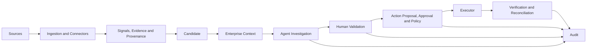

# System Overview

## Purpose

Technical-debt indicators can appear in source analysis, Git history, incidents,
dependency lifecycle data, enterprise asset relationships, or external work systems.
Each source sees only part of the situation.

A single finding is therefore not automatically technical debt. It may be duplicated,
misunderstood, weakly supported, or unrelated to the business and operational context
that determines its importance.

The platform collects technical and operational signals, preserves their evidence and
provenance, connects them with enterprise context, and creates candidate
technical-debt records. It then supports bounded agent investigation and human
validation. For validated records, external action is separated into proposal, human
approval, policy authorization, execution, verification, and audit.

The responsibility model is deliberate:

| Responsibility | Authority |
|---|---|
| Deterministic core | Establishes facts and system state. |
| AI agent | Investigates available evidence and recommends. |
| Human | Makes authoritative governance decisions. |
| Policy | Determines whether an approved action is allowed. |
| Executor | Performs the authorized external action. |
| Verification | Confirms the external result. |
| Audit | Preserves traceability. |

## What the System Does

The current PoC:

- detects controlled Semgrep findings and Git self-admitted technical-debt comments;
- normalizes Semgrep, Git, incident, and dependency-lifecycle observations into a
  common Signal and Evidence model;
- assigns stable source identities and persists duplicate-safe Signals and Evidence;
- correlates Signals into deterministic Candidates by canonical asset and problem
  family, with a separate recurrence rule for incidents;
- projects ownership, asset relationships, direct incidents, and service dependency
  reachability from a controlled enterprise estate;
- runs bounded investigations through three registered read-only agent tools;
- records structured assessments, references, tool executions, and tool-policy
  decisions;
- records human `VALIDATE`, `REJECT`, and `REQUEST_INFO` decisions;
- creates a `REGISTERED` TechnicalDebt record only after human validation;
- prepares, approves, policy-checks, and executes a controlled GitHub Issue action;
- reads the external issue back for verification or reconciliation; and
- exposes candidate, agent, governance, action, and connector views through a FastAPI
  backend and Nuxt frontend.

## What the System Does Not Do

- A Signal or Candidate does not become TechnicalDebt without a human `VALIDATE`
  decision.
- An agent assessment does not validate, reject, approve, or execute anything.
- A Connector does not receive mutation authority merely because it can read a source.
- Human approval does not bypass the deterministic execution policy.
- A successful execution response is not a verified result; verification is a
  separate read-back operation.
- Verification does not currently close TechnicalDebt. `REGISTERED` is the only
  implemented TechnicalDebt lifecycle state.

## High-Level System Model

## Current PoC Scope

The backend is a FastAPI application with domain and application services, SQLAlchemy
persistence, Alembic migrations, and Microsoft SQL Server integration. The Nuxt/Vue
frontend is a governance workspace for source inventory, candidate review, agent
investigation, human validation, TechnicalDebt review, and governed action handling.

The reproducible demonstration environment uses synthetic applications, services,
repositories, teams, ownerships, relationships, incidents, and controlled dependency
data. Semgrep and Git scanners operate on controlled local repositories. The default
agent provider is deterministic; an OpenAI provider is available only when explicitly
configured. GitHub read access, Issue creation, and verification are bounded reference
integrations requiring server-side configuration, with external writes disabled by
default.

This is a production-aware PoC, not a production-ready enterprise service. Production
identity, real enterprise source integration, operational hardening, and scale are
separate concerns from the current implementation.

## Related Documentation

- [End-to-End Flow](end-to-end-flow.md)
- [Core Concepts](core-concepts.md)
- [Implementation Status](implementation-status.md)
- [System Architecture](../02-architecture/system-architecture.md)
