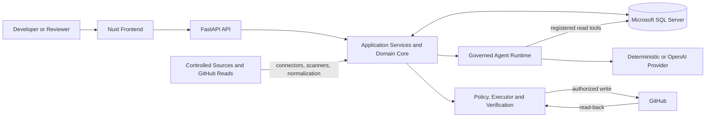

# System Architecture

This document describes the architecture implemented by the Current PoC Baseline. It
focuses on runtime responsibilities and dependency boundaries rather than the full
technical-debt lifecycle, which is covered by the overview documentation.

## Architectural Style

The system is an **extensible modular monolith**. The FastAPI backend is one primary
application boundary with explicit internal capability modules, one process-level
composition model, and shared SQL persistence. The Nuxt application is a separate
client of that backend API.

In practical terms, the backend has:

- one deployable application rather than independently deployed services;
- explicit modules for domain facts, ingestion, agent investigation, governance,
  actions, persistence, and API delivery;
- controlled dependencies between those capabilities; and
- technology-specific access to GitHub, OpenAI, local scanners, files, and MSSQL at
  explicit infrastructure or provider boundaries.

This is not a microservice architecture. Module boundaries provide separation inside
the application without introducing distributed-system infrastructure.

## High-Level Architecture

The diagram groups related modules for readability. In the code, agent audit and
governed-action state are also persisted in MSSQL.

## Main Architectural Layers

| Layer / Capability | Owns | Does not own |
|---|---|---|
| Frontend (`frontend/app`) | Nuxt pages, Vue components, API clients, response mapping, display state, and interaction flows. | Authoritative domain, governance, policy, or execution decisions. |
| API (`backend/app/api`) | HTTP routes, Pydantic request/response contracts, dependency wiring, and transport error mapping. | Domain meaning or direct external-system mutation. |
| Domain (`backend/app/domain`) | Immutable domain concepts and invariants for assets, signals, candidates, decisions, technical debt, proposals, policy outcomes, executions, and verifications. | HTTP, database sessions, provider SDKs, or GitHub transport. |
| Application processing (`backend/app/*_ingestion.py`, `candidate_correlation.py`) | Deterministic normalization and correlation of source observations into canonical facts and Candidate hypotheses. | Human validation or external write authority. |
| Governance (`backend/app/governance`) | Candidate governance transitions and the human-validation use case. | Agent reasoning, action policy, or external execution. |
| Agent (`backend/app/agent`) | Bounded investigation, tool contracts and registry, tool policy, structured assessments, provider ports, and provider implementations. | Authoritative validation, action approval, or arbitrary external writes. |
| Governed actions (`backend/app/actions`) | Proposal preparation, exact-payload approval, execution policy, executor and verifier ports, execution orchestration, and reconciliation. | Source acquisition or Candidate validation. |
| Connectors and source adapters (`backend/app/connectors`, selected `backend/app/infrastructure`) | Read-only acquisition contracts and source-specific loading or transport. | Canonical debt decisions or mutation authority. |
| Persistence (`backend/app/infrastructure/database`) | SQLAlchemy models, repositories, read models, database-backed composition, and MSSQL session access. | Redefining domain semantics or making AI and human decisions equivalent. |
| Infrastructure adapters (`backend/app/infrastructure`) | Semgrep, Git history, controlled JSON, GitHub HTTP, and action-plane GitHub implementations. | Governance authority or policy decisions. |

The Current PoC Baseline does not have a separate generic `application` package.
Use-case orchestration lives in the ingestion modules, `governance`, `agent`, and
`actions`, and some of these services call concrete database persistence functions.

## Dependency Direction

The core domain modules do not import the API, database, agent, governance, action, or
connector layers. API routes depend on application services and database read models;
application services depend on domain types and, in the current baseline, selected
SQLAlchemy persistence functions.

External technology is constrained more explicitly:

- the agent runtime depends on the `InvestigationProvider` protocol rather than the
  OpenAI SDK;
- Candidate tools depend on the `CandidateInvestigationReader` protocol;
- action orchestration depends on `GitHubIssueExecutor` and `GitHubIssueVerifier`
  protocols;
- connector registrations isolate acquisition metadata and callables from downstream
  Candidate and governance concerns; and
- the frontend consumes versioned API response contracts through composables instead
  of reimplementing backend authority rules.

Persistence maps and retrieves domain concepts; database models are storage shapes,
not substitutes for the domain contracts. Provider- or source-specific data must be
validated and mapped before it is treated as canonical fact.

## Current Deployment Shape

The PoC runs as a FastAPI backend and a Nuxt frontend configured with the backend base
URL. Backend database operations require an `mssql+pyodbc` connection to Microsoft SQL
Server. Semgrep and Git scanners operate on controlled local repositories, dependency
lifecycle data comes from controlled JSON, and incident data is seeded into the
database.

The deterministic investigation provider is the default. OpenAI and live GitHub read,
write, and verification behavior are opt-in server-side integrations. There is no
repository evidence of production orchestration, independently deployed backend
services, or a general ingestion scheduler.

## Related Documentation

- [Module Boundaries](module-boundaries.md)
- [Extension Architecture](extension-architecture.md)
- [Security and Trust Boundaries](security-and-trust-boundaries.md)
- [Architecture Decisions](architecture-decisions.md)
- [Implementation Status](../01-overview/implementation-status.md)
