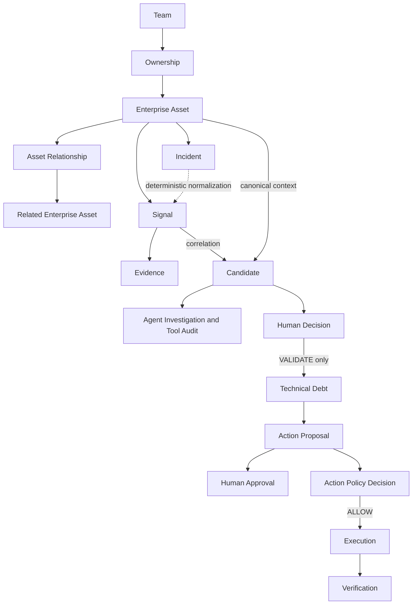

# Conceptual Data Model

## Purpose

This document describes the business concepts stored by the current PoC and how they
relate. It is independent of specific SQLAlchemy class names and physical table names.
A domain object, a persistence model, and the meaning of a database table are related,
but they are not the same thing.

## Main Concepts

| Concept | Definition | Why it exists |
|---|---|---|
| Enterprise Asset | A controlled application, service, or repository with a stable identity, type, name, criticality, and lifecycle status. | It gives technical and operational observations a canonical system anchor. |
| Team | A controlled organizational identity that can own an asset. | It makes responsibility available as factual enterprise context. |
| Ownership | A primary or supporting link between one Team and one Enterprise Asset. | It records who is associated with an asset without embedding ownership in every lifecycle record. |
| Asset Relationship | A directed `CONTAINS`, `IMPLEMENTED_BY`, or `DEPENDS_ON` edge between two Enterprise Assets. | It supports direct topology and derived service-dependency reachability. |
| Incident | A timestamped operational event with severity and one primary affected Enterprise Asset. | It provides operational context and can also be normalized into an operational Signal. |
| Signal | A canonical, source-observed event with an affected asset and source-independent type. | It preserves what was observed without declaring technical debt. |
| Evidence | A timestamped source reference attached to a Signal. | It gives reviewers and investigations inspectable support for the observation. |
| Provenance | The source system plus stable source-record identity carried by a Signal. | It supports traceability and duplicate-safe ingestion. |
| Candidate | A deterministic problem hypothesis that groups one or more Signals on one canonical asset. | It is the unit of investigation and human review; it is not validated TechnicalDebt. |
| Agent Investigation | A bounded run containing an optional structured assessment plus tool and tool-policy records. | It preserves advisory analysis and its grounding without granting lifecycle authority. |
| Human Decision | An append-only `VALIDATE`, `REJECT`, or `REQUEST_INFO` decision for a Candidate. | It records the authoritative governance step and its actor attribution. |
| Technical Debt | A governed record created from a Candidate only by a `VALIDATE` Human Decision. | It marks entry into the implemented lifecycle, whose only current status is `REGISTERED`. |
| Governed Action | The collective lifecycle of a proposal, exact-payload approval, action-policy decision, execution, and verification. | It separates intent, consent, authorization, external effect, and confirmation. |
| Audit Information | The durable Agent, human-decision, policy, action, execution, and verification records. | It makes the sequence of decisions and outcomes reconstructable without a generic audit table. |

## Conceptual Relationship Map

The map is lifecycle-oriented rather than a physical entity-relationship diagram.
For example, Candidate Evidence is the union of Evidence belonging to its member
Signals; the Candidate does not own a separate direct Evidence relationship.

## Enterprise Context vs Technical Debt Lifecycle

Enterprise context describes the environment around a potential problem: its asset,
owners, direct topology, incidents, and dependency reachability. These facts can exist
before any Signal or Candidate and do not make a debt judgment.

The technical-debt lifecycle describes how observations become a Candidate, how an
investigation and human decision are recorded, and how validated TechnicalDebt may
lead to a governed external action. Keeping the two areas separate prevents ownership,
criticality, or an incident from being mistaken for proof of technical debt.

## Important Identity Concepts

| Identity | Current meaning |
|---|---|
| `asset_key` | Unique stable business key for an Enterprise Asset; source normalization uses it to resolve the database asset row. |
| `team_key` | Unique stable business key for a Team. |
| `incident_key` | Unique identity for a seeded Incident and the source-record identity when that Incident is normalized. |
| `source_system` + `source_record_id` | Unique provenance for a Signal. Re-ingesting the same source observation is treated as a duplicate. |
| `signal_id` and `evidence_id` | Source-derived UUIDs produced deterministically by the current normalizers. |
| `candidate_id` | A deterministic UUID derived from asset type, asset key, and problem family, so changing group membership does not change the Candidate identity. |
| `technical_debt_id` | Identity of the governed record created by validation; it remains distinct from its source Candidate ID. |

Stable identities allow the system to correlate facts across runs while preserving
their origin. They also make repeated controlled ingestion reproducible.

## Related Documentation

- [Database Overview](database-overview.md)
- [Database Schema and Persistence](database-schema-and-persistence.md)
- [Enterprise Context](../04-signals-context-and-integrations/enterprise-context.md)
- [Evidence, Provenance and Correlation](../04-signals-context-and-integrations/evidence-provenance-and-correlation.md)
