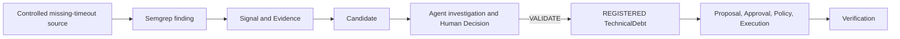

# Data Lifecycle

## Why This Matters

The persistence layer is easiest to understand by following one controlled finding
from its enterprise context through review and governed action. Each stage below is a
separate concept: a Signal is not TechnicalDebt, a Candidate is not validated debt,
approval is not policy authorization, and execution is not verification.

## Example Scenario

The controlled repository
`synthetic_repositories/repo-borealis-renderer/renderer_client.py` calls `urlopen`
without an explicit timeout. The current Semgrep rules detect this with
`tdi.python.missing-timeout` and normalize it to the `MISSING_TIMEOUT` Signal type for
the seeded asset `repo-borealis-renderer`.

The development population command materializes this scenario through Candidate
persistence. It intentionally stops there: it does not run an Agent investigation,
record a human decision, create TechnicalDebt, or execute an action. The later stages
in this walkthrough occur only when the corresponding implemented API/use case is
invoked.

## Lifecycle Walkthrough

| Stage | Domain Concept | Persisted entity / table | What is stored |
|---|---|---|---|
| 1. Establish context | Enterprise Asset, Team, Ownership, Relationship | `enterprise_assets`, `teams`, `asset_ownerships`, `asset_relationships` | `repo-borealis-renderer`, its primary `team-borealis` ownership, and the `svc-borealis-renderer IMPLEMENTED_BY repo-borealis-renderer` edge. |
| 2. Observe the source | Semgrep finding | No source-observation table | The scanner returns a source-specific in-memory finding containing the rule, repository-relative path, location, severity, and message. |
| 3. Normalize and persist facts | Signal, Evidence, Provenance | `signals`, `evidence` | `MISSING_TIMEOUT`, the affected asset foreign key, source system `semgrep`, an exact source-record identity derived from asset/path/rule/location, and an Evidence reference with capture time. |
| 4. Correlate the hypothesis | Candidate | `candidates`, `candidate_signals` | Deterministic Candidate ID, canonical asset, hypothesis `Potential MISSING_TIMEOUT issue affecting repo-borealis-renderer`, rationale, and Signal membership. Evidence remains linked through the Signal. |
| 5. Resolve enterprise context | Candidate enterprise/dependency context | Reads the estate tables; no separate context snapshot table | Ownership and direct relationships are loaded for the Candidate asset. The repository is mapped to its service dependency anchor through `IMPLEMENTED_BY`; reachability is derived without claiming impact. |
| 6. Investigate when requested | Agent investigation | `agent_runs`, `tool_executions`, `policy_decisions` | Run status and times, validated structured assessment JSON or stop reason, safe tool trace, Evidence references, and tool-policy outcomes. |
| 7. Validate when a human decides | Human Decision | `human_decisions` | Append-only decision type, sequence/revision, required rationale or requested information, server-owned actor reference, and time. Candidate governance state is derived from this history. |
| 8. Register governed debt | Technical Debt | `technical_debts` | Only `VALIDATE` creates a record linked uniquely to the Candidate and creating Human Decision, with current lifecycle status `REGISTERED`. |
| 9. Govern an external action | Proposal, Approval, Action Policy, Execution | `action_proposals`, `action_approvals`, `action_policy_decisions`, `action_executions` | Exact GitHub Issue preview and fingerprint, human approval of that fingerprint, deterministic policy result, durable execution claim, and safe external outcome/reference. |
| 10. Confirm the external result | Verification | `action_verifications` | Append-only `PASS`, `FAIL`, or `UNAVAILABLE` read-back result with safe reason and observed Issue reference where available. Verification does not close TechnicalDebt. |

Repeated ingestion of the same Semgrep observation returns `DUPLICATE` because its
source provenance is stable. Repeated correlation can return an unchanged Candidate
snapshot rather than creating a second lifecycle identity.

## Example Data Flow

## What Remains Persistent?

After an application restart, MSSQL retains:

- enterprise assets, ownership, topology, and incidents;
- Signals, Evidence, provenance, and Candidate membership;
- Agent run state, assessments, tool records, and tool-policy decisions;
- Human Decisions and the governance history from which Candidate state is derived;
- registered TechnicalDebt identity and status; and
- proposals, approvals, action-policy decisions, execution claims/outcomes, external
  references, and every persisted verification attempt.

In-memory scanner findings, composed read models, derived dependency reachability, and
API response objects are reconstructed or recalculated; they are not separate durable
records.

## What Is Not Ground Truth?

Runtime evaluation ground truth is intentionally separate from production application
state. The controlled expected correlation groups live in
`evaluation/ground_truth/correlation_cases.json`, outside `backend/app`. Runtime
modules do not import or load that file, and neither migrations nor the enterprise
seed create evaluation or ground-truth tables.

This prevents the system from reading its own expected answers while producing the
results that evaluation is meant to measure. Runtime application state shows what the
system observed and decided; evaluation ground truth is an external test oracle.

## Related Documentation

- [Database Overview](database-overview.md)
- [Database Schema and Persistence](database-schema-and-persistence.md)
- [Signal Ingestion and Normalization](../04-signals-context-and-integrations/signal-ingestion-and-normalization.md)
- [Human Validation and Lifecycle](../05-agent-and-governance/human-validation-and-lifecycle.md)
