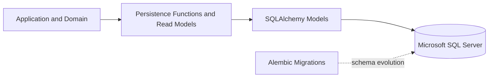

# Database Overview

## Why the Database Exists

The database is the persistent system of record for the current PoC implementation.
It stores the durable facts needed to reconstruct the technical-debt lifecycle:

- enterprise assets, teams, ownership, relationships, and incidents;
- normalized Signals, Evidence, and source provenance;
- correlated Candidates and their Signal memberships;
- Agent investigation runs, tool activity, and tool-policy decisions;
- human validation decisions and registered TechnicalDebt records; and
- action proposals, approvals, action-policy decisions, executions, and
  verifications.

Application logic decides what happens. The database preserves what happened and how
the stored entities are related. A stored Signal therefore remains an observation; it
does not become TechnicalDebt merely because it is durable.

## Technology Roles

### Microsoft SQL Server

Microsoft SQL Server (MSSQL) is the relational database used as the PoC system of
record. The backend requires an `mssql+pyodbc` connection when database behavior is
used.

### SQLAlchemy

SQLAlchemy is the synchronous Python persistence layer. Its mapping classes describe
how application persistence data is stored in tables, while repository and read-model
functions reconstruct domain and API-facing values.

### Alembic

Alembic versions schema changes. Its ordered revisions create and evolve the current
tables independently of runtime business decisions and seed data.

## Database in the System

Alembic changes database structure. It is not part of Signal correlation, human
validation, policy evaluation, or any other runtime business flow.

## Main Data Areas

| Data Area | Purpose |
|---|---|
| Enterprise context | Identifies applications, services, repositories, teams, ownership, directed asset relationships, criticality, lifecycle state, and incidents. |
| Signals and Evidence | Preserves canonical observations, exact source identities, supporting references, and capture times. |
| Candidates | Stores deterministic problem hypotheses and their normalized Signal memberships. |
| Agent investigation audit | Records runs, structured assessments, tool executions, and tool-policy decisions. |
| Human governance | Preserves append-only validation decisions and the TechnicalDebt record created only by `VALIDATE`. |
| Governed actions | Stores immutable proposals, exact-payload approvals, action-policy results, execution outcomes, and verification attempts. |

There is no single catch-all audit table. Auditability comes from the explicit agent,
human-decision, policy, execution, and verification records.

## PoC Data Boundary

The enterprise estate in this repository is synthetic and controlled. The database
is not a copy of a production configuration-management database (CMDB), incident
platform, repository catalog, or work-management system.

The persistence model demonstrates canonical identities, relationships, evidence,
governance, and action traceability in a repeatable environment. In a real enterprise,
connectors and source adapters would map external system facts into the canonical
model. They would not replace that model with manually copied vendor-specific data.

## Related Documentation

- [Conceptual Data Model](conceptual-data-model.md)
- [Database Schema and Persistence](database-schema-and-persistence.md)
- [Data Lifecycle](data-lifecycle.md)
- [Migrations, Seeding and Data Model Extension](migrations-seeding-and-extension.md)
- [System Architecture](../02-architecture/system-architecture.md)
