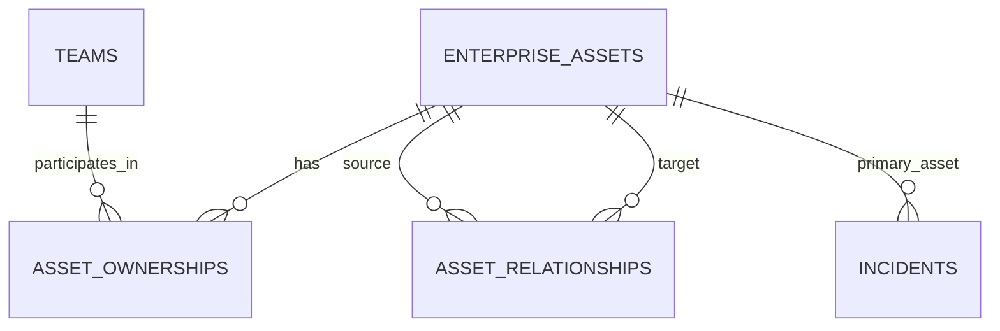
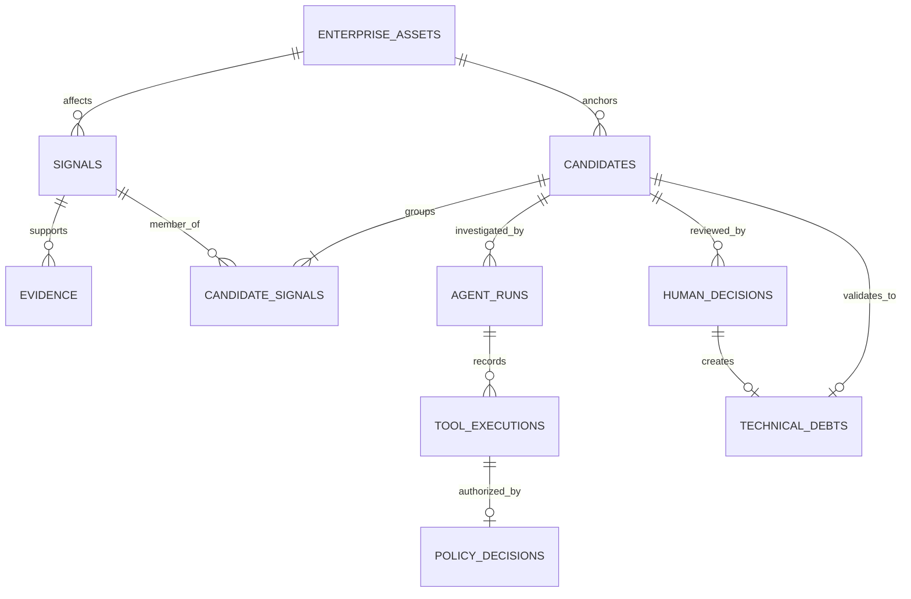
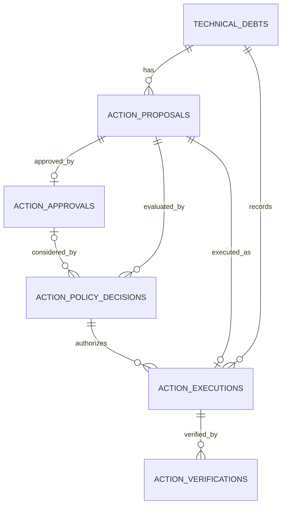

# Database Schema and Persistence

## Persistence Architecture

The current backend follows this mapping path:

```text
Domain / Application Concept
    -> persistence mapping or read model
    -> SQLAlchemy model
    -> relational table in MSSQL
```

Domain types define meaning and invariants. Persistence functions translate those
types to and from storage. SQLAlchemy models describe storage shape. A table is the
durable relational representation, not the definition of the business concept.

## Main Tables

The current Alembic revision chain defines the following application tables.

| Table | Purpose and important stored facts | Important relationships |
|---|---|---|
| `enterprise_assets` | Canonical asset row; unique `asset_key`, asset type, criticality, and lifecycle status. | Parent of ownerships, relationships, incidents, Signals, and Candidates. |
| `teams` | Controlled team identity; unique `team_key`. | Linked to assets through `asset_ownerships`. |
| `asset_ownerships` | Primary or supporting ownership assignment. | Required foreign keys to one asset and one team. |
| `asset_relationships` | Unique directed `CONTAINS`, `IMPLEMENTED_BY`, or `DEPENDS_ON` edge. | Required source and target foreign keys to `enterprise_assets`. |
| `incidents` | Unique `incident_key`, primary affected asset, severity, title, and start/resolution times. | Required foreign key to the primary affected asset. |
| `signals` | Canonical observation; UUID identity, unique source provenance, detection time, type, affected asset, and optional severity. | Required foreign key to `enterprise_assets`; parent of Evidence and Candidate memberships. |
| `evidence` | Supporting source reference, capture time, and optional URI. | Required foreign key to one Signal. |
| `candidates` | Deterministic Candidate snapshot; UUID identity, canonical asset, hypothesis, and correlation rationale. | Required foreign key to `enterprise_assets`; Signals linked through `candidate_signals`. |
| `candidate_signals` | Normalized membership between Candidates and Signals. | Composite primary key and required foreign keys to both parents. |
| `agent_runs` | Candidate investigation status, times, optional structured assessment JSON, and stop reason. | Required foreign key to one Candidate; parent of tool executions. |
| `tool_executions` | Ordered tool audit including tool identity/version, safe input hash and summary, status, timing, safe error data, and Evidence references. | Required foreign key to one Agent run. |
| `policy_decisions` | One tool-policy outcome, requested effect/risk, scopes, rule, and reason. | Primary key is also a foreign key to one tool execution. |
| `human_decisions` | Append-only Candidate decision with sequence, type, relevant text, actor reference, and time. | Required foreign key to one Candidate. |
| `technical_debts` | Governed record with UUID, `REGISTERED` status, creation time, source Candidate, and creating Human Decision. | Unique foreign keys to its source Candidate and creating decision. |
| `action_proposals` | Immutable GitHub Issue preview with target, title/body, SHA-256 payload fingerprint, reconciliation marker, preparer, and time. | Required foreign key to one TechnicalDebt. |
| `action_approvals` | Approval bound to one exact proposal fingerprint, actor, and time. | Required and unique foreign key to one proposal. |
| `action_policy_decisions` | Append-only `ALLOW` or `DENY` result with rule and reason. | Required foreign key to a proposal; optional foreign key to its approval. |
| `action_executions` | Durable execution claim and outcome, including status, creating policy decision, safe error category, times, and optional external Issue reference. | Required foreign keys to proposal, TechnicalDebt, and the creating policy decision. |
| `action_verifications` | Append-only read-back result, optional observed Issue reference, reason, and time. | Required foreign key to one action execution. |

`policy_decisions` belongs to Agent tool authorization.
`action_policy_decisions` belongs to governed external action execution. They are
deliberately separate tables and concepts.

## Relationship Diagrams

### Enterprise context



### Signals, Candidates, investigation, and validation



### Governed actions



## Domain vs Persistence

`app.domain.signals.Signal` is the immutable domain concept. `SignalModel` in
`backend/app/infrastructure/database/signal_models.py` maps its stored form, and
`signals` is the relational table. The domain object refers to an affected asset by a
canonical key and type; the table stores a foreign key to the resolved asset row.

A second example is Candidate governance. `CandidateGovernanceState` is not a column
on `candidates`. The current state and revision are derived from ordered
`human_decisions`; a matching `technical_debts` row exists only after `VALIDATE`.
Similarly, a domain `Candidate` exposes Evidence IDs, but the database reconstructs
them through `candidate_signals -> signals -> evidence` rather than storing a separate
Candidate-Evidence table.

## Repository and Persistence Services

Persistence code lives in `backend/app/infrastructure/database/`:

- `*_models.py` files define SQLAlchemy mappings;
- `*_persistence.py` files insert, update, and reconstruct domain records;
- `candidate_read_model.py` and `technical_debt_read_model.py` assemble consistent
  views across several tables; and
- `candidate_enterprise_context.py` and `candidate_dependency_context.py` derive
  read-only context from the stored estate.

Signal and Candidate persistence helpers flush but leave commit or rollback to the
caller. Signal persistence checks exact provenance before insert. Candidate
persistence creates, updates, or leaves unchanged a deterministic snapshot and
validates its Signal, Evidence, and asset consistency.

Lifecycle use cases own transactions where atomic authority matters. Human validation
stores the Human Decision and, for `VALIDATE`, TechnicalDebt in one transaction.
Preparation and approval each own their transaction. Execution commits its policy
decision and `IN_PROGRESS` claim before the external call, performs the network call
outside the database transaction, and then stores the terminal result. Verification
also performs external read-back outside a database transaction before appending its
result.

The Agent runtime stores run transitions and appends tool and tool-policy records
through `agent_audit_persistence.py`. It persists structured assessments as validated
JSON and deliberately does not store raw provider payloads or hidden reasoning.

## Constraints and Integrity

Important current controls include:

- unique stable enterprise keys: `asset_key`, `team_key`, and `incident_key`;
- unique Signal provenance on (`source_system`, `source_record_id`);
- foreign keys from Signals and Candidates to canonical enterprise assets;
- composite Candidate-Signal membership keys;
- ordered, unique Human Decision sequence numbers per Candidate;
- at most one TechnicalDebt per source Candidate and per creating Human Decision;
- constrained types and statuses for assets, incidents, decisions, TechnicalDebt,
  Agent audit, proposals, policy outcomes, executions, and verifications;
- one approval and one execution per Action Proposal;
- a unique reconciliation marker per proposal; and
- a filtered unique index that prevents more than one live
  `CREATE_GITHUB_ISSUE` execution for a TechnicalDebt while status is
  `IN_PROGRESS`, `SUCCEEDED`, or `UNKNOWN`.

MSSQL `UPDLOCK, HOLDLOCK` hints serialize Candidate validation and TechnicalDebt
action approval/execution boundaries. Application and read-model validation adds
cross-row meaning that a foreign key alone cannot express, such as requiring a
TechnicalDebt creation decision to be `VALIDATE`.

## Related Documentation

- [Conceptual Data Model](conceptual-data-model.md)
- [Data Lifecycle](data-lifecycle.md)
- [Migrations, Seeding and Data Model Extension](migrations-seeding-and-extension.md)
- [Module Boundaries](../02-architecture/module-boundaries.md)
