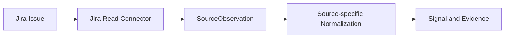

# Adding a New Connector

## Before You Start

Add a Connector when an external system or controlled source is genuinely a new
acquisition boundary with its own configuration, records, and failure behavior. Do not
use the Connector registry merely to add another mapping for an existing observation
type.

These are separate changes:

- a **new source** acquires a new kind of source record;
- a **new normalizer** gives supported observations canonical Signal meaning;
- a **new agent tool** exposes a typed capability to bounded investigation; and
- a **new Executor** performs an authorized external mutation.

A read Connector must not introduce external write authority.

## Step 1: Understand the Source Contract

Before coding, identify:

- the source system name and records that must be read;
- a stable external record identifier;
- a trustworthy, timezone-aware observation timestamp;
- how each record maps to a canonical enterprise asset;
- the minimum fields needed for useful Evidence and provenance;
- source configuration, authentication, timeouts, and safe error handling; and
- whether the source produces Signals at all.

If stable identity or asset mapping is unavailable, resolve that design gap before
persisting canonical facts.

## Step 2: Implement the Connector Contract

Use `backend/app/connectors/contracts.py`. Create:

1. a source-specific configuration type and validated record type, normally at the
   infrastructure boundary;
2. an acquisition callable matching `SourceConnector`: it accepts that configuration
   and returns `tuple[SourceObservation[YourRecord], ...]`;
3. a truthful, immutable `ConnectorDescriptor`; and
4. a `ConnectorRegistration` pairing the descriptor and callable.

The callable should preserve source order unless the source contract says otherwise.
It should return observations only, not Candidates or Technical Debt. The generic
contract defines no common error result, so follow the existing source-boundary
pattern: validate required fields and raise narrowly named configuration, transport,
API, or format errors as applicable without leaking credentials or raw sensitive
payloads.

The current implementations are in `backend/app/connectors/dependency_lifecycle.py`
and `backend/app/connectors/github_issues.py`, with source access under
`backend/app/infrastructure/`.

## Step 3: Map to a Source Observation

Wrap each validated vendor or source record in `SourceObservation`:

- set `provenance` to a `SourceObservationRef` containing the source system and stable
  record ID;
- set `observed_at` to the record's timezone-aware source timestamp; and
- keep the typed source-specific record in `record`.

Do not add vendor fields to the canonical `Signal` merely to avoid mapping them. Keep
them at the source boundary and retain the review-relevant subset in Evidence.

## Step 4: Normalize

If the source produces technical-debt Signals, add a deterministic source-specific
normalizer following the existing `*_ingestion.py` modules. It must produce a
`NormalizedSignal` with:

- a stable `signal_id`;
- `source_system` and `source_record_id` matching the observation provenance;
- a timezone-aware `detected_at`;
- an approved canonical `signal_type`;
- a resolved `CanonicalAssetRef` with `asset_key` and asset type;
- optional severity when the source provides meaningful severity; and
- at least one matching Evidence item with source reference and capture time.

If you add an observation-to-normalizer bridge, verify that provenance and observation
time agree with the source record before mapping. Do not add a normalizer when the
source is inventory or context only.

## Step 5: Register / Compose

Add the registration explicitly to `CONNECTOR_REGISTRY` in
`backend/app/connectors/registry.py` and extend the `RegisteredConnector` type alias
for its configuration and record types. The registry rejects a duplicate
`connector_id`.

`list_connectors` will then expose the descriptor through the existing connector
inventory API. `get_connector` resolves a registration by ID. Registration alone does
not run the Connector, prove source health, or schedule ingestion; compose any actual
ingestion use case explicitly at the appropriate application boundary.

## Step 6: Configure

Add server-owned settings to `backend/app/core/config.py` using the existing Pydantic
settings pattern, and document placeholders in `backend/.env.example`. Validate
required combinations before network access. Typical values include a base URL or
source identity, repository or project identifier, request timeout, and an optional
secret token.

Use `SecretStr` for credentials, never commit a real secret, and never return secrets
or raw sensitive responses in errors. Clients must not select server credentials.

## Step 7: Preserve Provenance

This is required. The implementation must always be able to answer:

> Which external record produced this application observation?

Use the stable external ID in `SourceObservationRef`; do not use a list position,
display title, or current timestamp as identity. If the observation becomes a Signal,
preserve the same `source_system` and `source_record_id` through normalization.

Signal persistence treats that pair as unique and returns `DUPLICATE` for a repeated
observation. Add tests proving that repeated acquisition and normalization preserve
identity and do not create duplicate truth.

## Step 8: Test

Match the existing test structure and add only the layers the integration needs:

- Connector contract and registry tests under `backend/tests/connectors/`;
- source configuration, parsing, transport, and failure tests under
  `backend/tests/infrastructure/`;
- mapping and normalization tests beside the other ingestion tests;
- persistence tests for duplicate identity, Evidence, and asset resolution when the
  source creates Signals;
- opt-in external or database integration tests only where appropriate; and
- boundary tests confirming acquisition does not create Candidates, grant write
  authority, or leak sensitive payloads.

From `backend/`, the verified automated test command is:

```powershell
pytest
```

Run a narrower relevant test selection during development, then the backend suite
before handing off the change. External tests must remain explicitly opt-in.

## Example: Jira Read Connector

**This is an extension example, not a current PoC capability.**



The conceptual mapping would preserve Jira's stable issue identity and update time,
keep its API payload at the boundary, resolve the affected canonical asset, and map
only an explicitly approved meaning to a Signal. If Jira records were used only as
context, the flow would stop before Signal normalization. A Jira writer would require
a separate Executor and governance path.

## Connector Checklist

- [ ] Connector contract implemented
- [ ] Stable source identity preserved
- [ ] Normalization mapped when the source produces Signals
- [ ] Asset mapping defined
- [ ] Evidence and provenance preserved
- [ ] Registration completed
- [ ] Configuration documented safely
- [ ] Contract, mapping, duplicate, and failure tests added
- [ ] No external write authority introduced

## Related Documentation

- [Connector Architecture](connector-architecture.md)
- [Signal Ingestion and Normalization](signal-ingestion-and-normalization.md)
- [Evidence, Provenance and Correlation](evidence-provenance-and-correlation.md)
- [Extension Architecture](../02-architecture/extension-architecture.md)
- [Extending the System](../06-api-frontend-and-development/extending-the-system.md)
