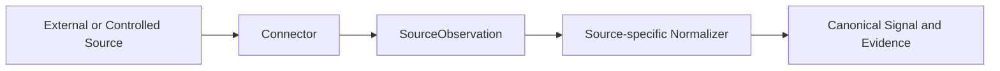

# Connector Architecture

## What Is a Connector?

A Connector is a read-oriented adapter registered with stable metadata and an
acquisition callable. It knows how to read a particular source and return typed
`SourceObservation` values containing exact provenance, a timezone-aware observation
time, and a source-specific record.

Connectors acquire facts; they do not decide canonical meaning. When a connector feeds
the Signal pipeline, a separate source-specific normalizer maps its observations to
`NormalizedSignal` values.

Not all current ingestion code uses this abstraction. Semgrep and Git use local
scanners, and incidents use a database loader. The formal Connector registry currently
contains only Dependency Lifecycle and GitHub Issues.

## Connector vs Source

The **source** is the external system or origin of information. The **Connector** is
the application component that knows how to communicate with it.

For example, GitHub is an external source. The GitHub Issues read Connector is the
adapter that performs a GET request and maps the response to minimal
`GitHubIssueRecord` observations.

## Connector Flow



The last two steps are conditional: GitHub Issues currently has acquisition but no
normalizer, while Dependency Lifecycle implements the complete bridge.

## Connector Contract

The contract is defined in `backend/app/connectors/contracts.py`:

- `ConnectorDescriptor` declares `connector_id`, display name, version,
  `source_system`, transport, and whether the connector is read-only;
- `SourceObservation[SourceRecord]` carries `SourceObservationRef`, `observed_at`, and
  the typed source record;
- `SourceConnector` is a callable type taking source configuration and returning a
  tuple of observations; and
- `ConnectorRegistration` pairs one descriptor with its acquisition callable.

The contract does not prescribe a shared authentication type or a universal error
result. Each source boundary validates its own configuration and response and raises
source-specific errors. Canonical Signals, Candidates, persistence, and delivery
concerns remain outside connector acquisition.

## Registry / Composition

`backend/app/connectors/registry.py` defines `CONNECTOR_REGISTRY` as an immutable,
explicit in-code tuple of registrations. `ConnectorRegistry` rejects duplicate
connector IDs, preserves registration order, lists registrations, and resolves one by
ID through `get_connector`.

Composition happens by importing each registration and adding it to that tuple. The
connector inventory API calls `list_connectors` and returns descriptor metadata with
status `registered`; listing does not execute acquisition and does not report source
health or ingestion success. There is no dependency-injection framework, dynamic
plug-in discovery, or general ingestion scheduler in the current baseline.

## Current Connector Implementations

| Connector | Transport | Acquired Record | Signal Path |
|---|---|---|---|
| Dependency Lifecycle | `local-json` | `DependencyLifecycleFinding` | Complete controlled path: acquire observation, resolve the canonical asset, normalize to `DEPENDENCY_EOL`, and persist through the shared Signal path. |
| GitHub Issues | `https` | Minimal `GitHubIssueRecord` | Read-only acquisition of one page of open Issues from a configured public repository. Pull requests are ignored. No current Signal normalizer or persistence path. |

The GitHub record retains only issue ID, number, title, state, HTML URL, and update
time. Its stable provenance uses the GitHub issue ID rather than the repository-local
issue number. The implementation uses GET only and does not use the governed GitHub
Issue writer.

Semgrep findings, Git SATD observations, and seeded incidents are real implemented
Signal sources, but they are not `ConnectorRegistration` implementations.

## Read Boundary

Current Connectors are explicitly declared read-only. External mutation belongs to a
separate Executor reached through proposal, human approval, deterministic policy, and
execution controls.

```text
Connector != Executor
```

The GitHub Issues Connector reads source observations. The separately configured
GitHub Issue executor can create an Issue only through the governed action path.

## Why This Boundary Matters

- source-specific coupling remains at the acquisition edge;
- read access does not silently gain write authority;
- contracts and mappings can be tested with bounded inputs;
- a source implementation can be replaced without changing Candidate semantics;
- provenance is explicit at acquisition; and
- write governance evolves independently from source reads.

## Related Documentation

- [Adding a New Connector](adding-a-new-connector.md)
- [Extension Architecture](../02-architecture/extension-architecture.md)
- [Policy, Actions, Execution and Audit](../05-agent-and-governance/policy-actions-execution-and-audit.md)
