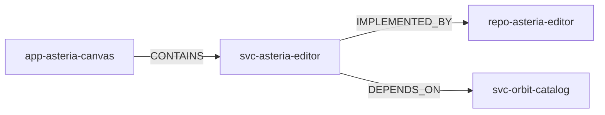

# Enterprise Context

## Why Enterprise Context Exists

A code or operational finding alone does not show the organizational and system
setting around a potential problem. A repository can implement a service, a service
can belong to an application, one team can own the asset, and other services can
depend on it. The affected asset may also have an incident history.

The PoC projects these facts around a Candidate so reviewers and investigations can
understand its setting. Context enriches a Candidate; it does not validate technical
debt, prove causality, or calculate impact.

## Enterprise Asset Model

The current model supports exactly three asset types:

- `APPLICATION`
- `SERVICE`
- `REPOSITORY`

An `EnterpriseAsset` has a unique, stable `asset_key`, plus a name, criticality, and
lifecycle status. Normalizers use a `CanonicalAssetRef` containing `asset_key` and
asset type. Signal and Candidate persistence resolve that reference against the
enterprise catalog and reject a missing asset or mismatched type.

## Ownership

Teams have stable `team_key` values. `AssetOwnership` links one Team to one asset with
either a `PRIMARY` or `SUPPORTING` role. The Candidate enterprise-context read returns
the ownership records and Team details attached directly to the Candidate asset.

Ownership matters because a potential issue needs a responsible organizational
context for review and remediation. It remains factual context: ownership does not
make a Candidate valid or assign governance authority by itself.

## Asset Relationships

The implemented relationship types are directed:

- `CONTAINS`: an application contains a service;
- `IMPLEMENTED_BY`: a service is implemented by a repository; and
- `DEPENDS_ON`: one service depends on another service.

This controlled Asteria example uses only relationships present in the repository:

Enterprise-context reads return relationships that directly touch the Candidate
asset. Dependency-context reads additionally build a directed graph from service
`DEPENDS_ON` edges. A service Candidate is its own dependency anchor; a repository is
mapped to service anchors through `IMPLEMENTED_BY`, and an application through
`CONTAINS`. The result reports anchors, direct dependencies, direct dependents, and
reachable dependents without inferring risk or causal impact.

## Incident Context

An `Incident` records a stable `incident_key`, severity, title, start and optional
resolution time, and one primary affected asset. The enterprise-context projection
returns incidents directly attached to the Candidate asset.

An incident is not automatically technical debt. It can be operational context and,
through the separate incident normalizer, it can also become an
`OPERATIONAL_INCIDENT` Signal. Only deterministic correlation can turn repeated
Signals into a Candidate, and only downstream human validation can create governed
Technical Debt.

## Dependency Context

The PoC uses dependency information in two distinct ways:

- the controlled dependency lifecycle source reports a component at end of life; its
  observation can become a `DEPENDENCY_EOL` Signal on an affected asset; and
- enterprise `DEPENDS_ON` relationships describe service topology used for dependency
  reachability around a Candidate.

The first is a technical observation. The second is enterprise context. A lifecycle
finding does not create a service relationship, and a relationship does not itself
create a Signal.

## Controlled Enterprise Estate

The Current PoC Baseline uses a deterministic synthetic enterprise estate, not a real
CMDB. It defines eight fictional assets, three teams, primary and supporting
ownerships, eight relationships, and four incidents.

This controlled estate exists to:

- demonstrate asset, ownership, incident, and dependency relationships;
- provide stable context for normalization and Candidate reads;
- enable repeatable automated evaluation and tests; and
- avoid dependence on production enterprise or institutional data.

The seed is idempotent for its controlled baseline and does not create Signals,
Candidates, human decisions, or Technical Debt.

## Related Documentation

- [Signal Ingestion and Normalization](signal-ingestion-and-normalization.md)
- [Evidence, Provenance and Correlation](evidence-provenance-and-correlation.md)
- [Conceptual Data Model](../03-data-and-database/conceptual-data-model.md)
- [Agent Overview](../05-agent-and-governance/agent-overview.md)
