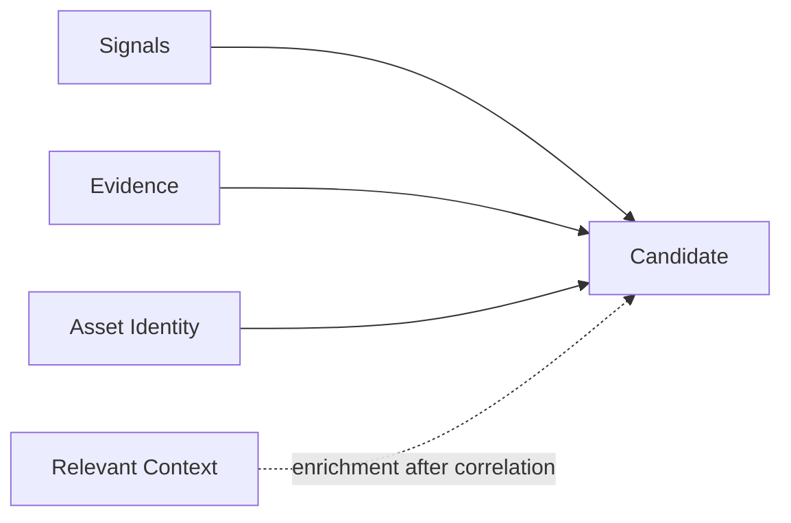

# Evidence, Provenance and Correlation

## Evidence

Evidence is inspectable information that supports or explains a Signal, Candidate,
investigation, or decision. It is support for review, not a validation result.

Every normalized Signal in the current PoC has at least one matching Evidence item.
Verified examples include:

- a Semgrep repository path, exact location, rule identifier, and message;
- a Git commit hash, repository path, added line, and SATD comment;
- an incident key, title, and affected asset; and
- a dependency component, version, lifecycle status, end-of-life date, and source
  message.

The stored Evidence contract contains an ID, source system, concise source reference,
capture time, and optional reference URI. It does not contain validation or governance
state.

## Provenance

Provenance records where an observation came from. In the current Signal model it is
the exact pair `source_system` and `source_record_id`. Evidence may explain what was
seen; provenance identifies the originating record.

For example, the controlled incident `inc-orbit-001` becomes an
`OPERATIONAL_INCIDENT` Signal with provenance
`incident-management` + `inc-orbit-001`. That origin remains the same regardless of
whether a reviewer later agrees with a Candidate. Provenance establishes traceability,
not correctness.

## Why Provenance Matters

- **Reproducibility:** the application can identify the exact observation used.
- **Duplicate prevention:** repeated acquisition of the same source identity does not
  create another Signal.
- **Auditability and explainability:** reviewers can connect canonical meaning back to
  its source reference.
- **Mapping diagnostics:** a faulty normalizer can be investigated at the source
  boundary without losing record identity.

## Correlation

Correlation deterministically groups normalized Signals into a Candidate representing
a potential underlying problem. The current logic in
`backend/app/candidate_correlation.py` does not use AI, similarity scoring, or
probabilities.

For most Signals, the group key is the exact combination of:

- canonical asset type;
- canonical `asset_key`; and
- `signal_type`, used as the problem family.

Incident Signals are the one special case. Signals from `incident-management` with
type `OPERATIONAL_INCIDENT` use problem family `RECURRING_INCIDENT_PATTERN`, and at
least two distinct Signal IDs must affect the same asset before a Candidate is
created. The rationale explicitly states that recurrence does not establish a common
root cause.

The Candidate ID is a deterministic UUID derived from asset type, asset key, and
problem family. Signal membership is not part of that ID. Persistence therefore
creates the Candidate once, updates its snapshot when membership or text changes, and
returns `UNCHANGED` for the same snapshot. Signals from different assets or different
problem families are never merged.

## Candidate Creation

Correlation itself consumes normalized Signals, carrying their Evidence IDs and
canonical asset into the Candidate. Enterprise context is read for the persisted
Candidate afterward; it does not alter the correlation key.

The result is a hypothesis with Signal IDs, Evidence IDs, a canonical asset, and a
correlation rationale. **Candidate is not Technical Debt.** It still requires
investigation and an authoritative human validation decision.

## Correlation Example

The controlled estate contains three incidents for `svc-orbit-catalog`:
`inc-orbit-001`, `inc-orbit-002`, and `inc-orbit-003`. Normalization creates three
distinct `OPERATIONAL_INCIDENT` Signals and three supporting Evidence references, all
anchored to the same service.

Correlation places them in the `RECURRING_INCIDENT_PATTERN` problem family. Because
the group contains more than one distinct Signal, it creates one Candidate with the
hypothesis `Potential recurring operational incident pattern affecting
svc-orbit-catalog`. The Candidate includes all three Signal and Evidence IDs. Its
rationale reports the recurrence and deliberately makes no common-root-cause claim.

The incidents remain operational observations, and the Candidate remains a hypothesis
until downstream governance decides otherwise.

## Related Documentation

- [Signal Ingestion and Normalization](signal-ingestion-and-normalization.md)
- [Enterprise Context](enterprise-context.md)
- [Core Concepts](../01-overview/core-concepts.md)
- [Human Validation and Lifecycle](../05-agent-and-governance/human-validation-and-lifecycle.md)
