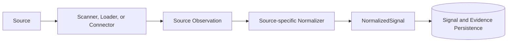

# Signal Ingestion and Normalization

## Why Ingestion and Normalization Exist

Technical and operational sources describe observations in different shapes. Semgrep
reports rules and code locations, Git history reports commits and added comments,
incident records describe operational events, and the controlled dependency source
describes component lifecycle findings.

The application validates those source-specific facts and maps supported observations
to a common `Signal` model. Downstream correlation can then use canonical meaning and
canonical asset identity without depending on a Semgrep JSON field, Git commit shape,
or dependency-export schema.

The boundaries remain distinct:

```text
Source Observation != Normalized Signal
Signal             != Evidence
Signal             != Candidate
Candidate          != Technical Debt
```

## Ingestion Flow



`NormalizedSignal` contains exactly one canonical `Signal` and a non-empty set of
matching `Evidence`. The diagram represents the complete path for supported signal
sources. The GitHub Issues connector currently stops after acquisition; it has no
normalizer or signal-persistence path.

## Current Source Types

| Source | Observation Type | Ingestion Mechanism | Current Scope |
|---|---|---|---|
| Semgrep | `SemgrepFinding` | Local repository scan using the rules in `backend/semgrep/rules.yml` | Controlled repositories; normalizes three approved Python rules. This is a scanner, not a registered Connector. |
| Git history | `GitSatdFinding` | PyDriller scan of added Python comments | Repository scanning for explicit "technical debt" or "tech debt" comments; not a registered Connector. |
| Incident data | `Incident` plus its affected asset | Database loader over seeded incidents | Controlled operational data normalized to incident Signals; not a registered Connector. |
| Dependency lifecycle | `SourceObservation[DependencyLifecycleFinding]` | Registered read-only `local-json` Connector and validated loader | Controlled JSON input with one supported `END_OF_LIFE` status and a complete normalization path. |
| GitHub Issues | `SourceObservation[GitHubIssueRecord]` | Registered read-only HTTPS Connector using the GitHub REST API | Real, opt-in external read of open Issues from one configured public repository. Acquisition only; no Signal normalizer. |

The development population command is narrower than this inventory: it ingests the
three controlled Semgrep findings and four seeded incidents. Git SATD and dependency
lifecycle ingestion are implemented and tested through separate paths.

## Canonical Signal Model

Normalization exists so that source syntax does not become application meaning. The
verified `Signal` fields are:

- `signal_id`: a deterministic UUID for the normalized observation;
- `source_system` and `source_record_id`: exact provenance and duplicate identity;
- `detected_at`: a timezone-aware observation time;
- `signal_type`: the source-independent problem meaning;
- `affected_asset`: a canonical `asset_key` and `AssetType` pair;
- optional `severity`; and
- `evidence_ids`: the Evidence items supporting the Signal.

Each normalizer also creates Evidence with `evidence_id`, `source_system`, a concise
`source_reference`, `captured_at`, and an optional `reference_uri`. Source-specific
fields remain in the observation or are summarized in Evidence rather than being
added to every Signal.

## Source-Specific Meaning vs Canonical Meaning

A Semgrep finding for rule `tdi.python.missing-timeout` contains a repository-relative
file and exact location. `normalize_semgrep_finding` maps it to the canonical signal
type `MISSING_TIMEOUT` while retaining the rule, location, message, and repository in
Evidence.

A seeded `Incident` has an incident key, severity, title, and start time.
`normalize_incident` maps it to `OPERATIONAL_INCIDENT`, preserves the incident key as
its source record identity, and anchors it to the primary affected asset. Correlation
therefore consumes canonical Signals rather than incident-table or scanner fields.

## Duplicate Handling

The current normalizers derive stable Signal and Evidence UUIDs from exact source
identity. More importantly, persistence treats the pair `source_system` plus
`source_record_id` as unique. `persist_normalized_signal` checks that pair before
insert and returns `CREATED` or `DUPLICATE`; the database also enforces the uniqueness
constraint.

Repeated ingestion of the same observation therefore does not create a second stored
truth. A changed source identity is a distinct observation. Candidate identity is
separately stable by asset and problem family, so repeated correlation can leave a
Candidate `UNCHANGED` or update its Signal membership without creating a second
Candidate identity.

## Related Documentation

- [Evidence, Provenance and Correlation](evidence-provenance-and-correlation.md)
- [Enterprise Context](enterprise-context.md)
- [Connector Architecture](connector-architecture.md)
- [Database Schema and Persistence](../03-data-and-database/database-schema-and-persistence.md)
