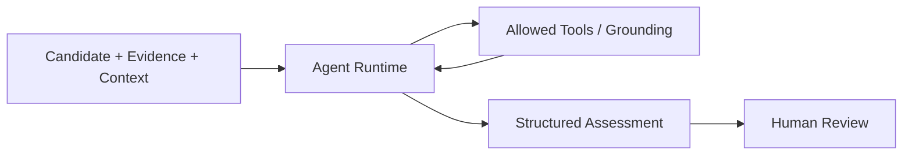

# Agent Overview

## Why the Agent Exists

The deterministic core already establishes the facts that define a Candidate: its
identity, canonical asset, Signals, Evidence, provenance, hypothesis, and correlation
rationale. Database read models also make recorded ownership, asset relationships,
incidents, and dependency reachability available where they exist.

The agent exists to investigate that bounded evidence package and produce a
structured assessment for a human reviewer. It can organize support, identify missing
information or uncertainty, and recommend a next step. It does not become the source
of truth for technical-debt facts, and its output does not change Candidate or
TechnicalDebt state.

The Current PoC Baseline uses a deterministic investigation provider by default. An
OpenAI-backed provider can be selected through server configuration. Both use the
same governed runtime and output contract.

## Agent Inputs

An investigation starts with a persisted Candidate ID and server-owned authorization.
The runtime supplies the provider with the registered tool descriptors, remaining
runtime budgets, and validated results from earlier tool calls. The production tool
registry can retrieve:

- Candidate identity, canonical asset, hypothesis, correlation rationale, Signals,
  Evidence, and provenance;
- dependency anchors, direct dependencies, direct dependents, and reachable
  dependents; and
- the Candidate asset, recorded ownership, direct asset relationships, and direct
  incidents.

These values come from database-backed read models. Dependency reachability does not
establish causality or risk, and asset criticality does not establish technical debt.
The current registry has no architectural-guidance or general knowledge-retrieval
tool.

## Agent Output

`StructuredAssessment` in `backend/app/agent/audit_contracts.py` is the application
output model. It contains:

- an outcome: `SUPPORTED` or `ABSTAINED`;
- an optional grounded conclusion;
- zero or more grounded supporting claims;
- missing-evidence and uncertainty lists;
- an optional recommendation; and
- an optional controlled stop reason.

Each conclusion or supporting claim must cite at least one available Evidence or
ToolExecution reference. A supported assessment requires a grounded conclusion. An
abstention cannot contain a conclusion and must explain why it stopped. Runtime
failures may end without an assessment and retain a safe stop reason instead.

The recommendation remains advisory. It is not a human validation decision, an action
approval, or policy authorization.

## Responsibility Boundary

| Component | Responsibility |
|---|---|
| Deterministic Core | Establish facts and state |
| Agent | Investigate and recommend |
| Human | Make authoritative decision |
| Policy | Authorize or deny action |
| Executor | Perform approved action |
| Verification | Confirm result |

Audit records preserve the decisions and observations produced across these
boundaries.

## What the Agent Can and Cannot Do

| Can | Cannot |
|---|---|
| Read Candidate-scoped context through registered tools | Declare a Candidate to be authoritative TechnicalDebt |
| Inspect persisted Signals, Evidence, provenance, dependencies, ownership, relationships, and incidents exposed by those tools | Perform or bypass Human Validation |
| Request only capabilities advertised by the registry | Register or execute an arbitrary tool |
| Produce a validated, grounded assessment or abstain | Approve an action or bypass action policy |
| Report missing evidence and uncertainty | Directly invoke the GitHub write executor |
| Cite Evidence and ToolExecution records made available in the run | Treat an unsupported claim as verified evidence |

## High-Level Flow

The human review boundary is deliberate: **deterministic fact is not AI
interpretation, and AI recommendation is not human decision**.

## Current PoC Boundary

The PoC demonstrates bounded investigation, structured output, grounding, tool
policy, and durable traces. It does not implement enterprise identity or role-based
authorization, a broad knowledge-retrieval layer, autonomous remediation, or
production monitoring. Server settings currently provide the provider choice,
credentials, runtime limits, and temporary Candidate read authority.

## Related Documentation

- [Investigation Runtime and Tools](investigation-runtime-and-tools.md)
- [Provider and Grounding](provider-and-grounding.md)
- [Human Validation and Technical Debt Lifecycle](human-validation-and-lifecycle.md)
- [Security and Trust Boundaries](../02-architecture/security-and-trust-boundaries.md)
