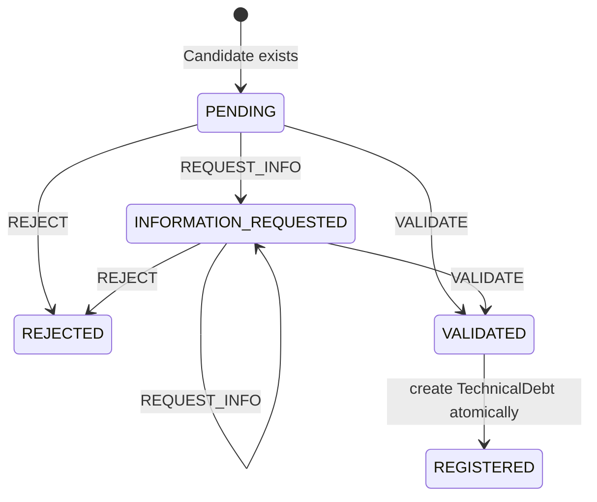

# Human Validation and Technical Debt Lifecycle

## Why Human Validation Exists

A Candidate is a deterministic problem hypothesis assembled from Signals and
Evidence. It is a potential technical-debt item, not governed TechnicalDebt. An agent
assessment can help a reviewer interpret the available facts, but it remains
advisory.

The authoritative decision belongs to a human operating through the Human Validation
boundary:

```text
Candidate != TechnicalDebt
AI Recommendation != Human Decision
```

The API obtains actor attribution and feature enablement from server-owned settings.
The PoC does not accept a client-supplied actor, role, provider, or model as governance
authority.

## Validation Inputs

The Nuxt Candidate detail workspace makes the following implemented information
available for review:

- Candidate hypothesis, correlation rationale, and canonical asset;
- Signals and their Evidence IDs;
- Evidence source references, source systems, capture times, and optional reference
  URIs;
- Signal provenance through source system and source-record identity;
- enterprise asset details, ownership, direct relationships, and direct incidents;
- dependency anchors and reachability context;
- an on-demand AgentRun with structured assessment, missing evidence, uncertainties,
  recommendation, and grounding references; and
- recorded tool activity and tool-policy decisions for that investigation.

An agent run is not required by the backend Human Validation command. The human is
responsible for the decision using the information available in the review workflow.

## Validation Decisions

The current `HumanDecisionType` supports exactly three decisions:

| Decision | Meaning | Required content | Resulting Candidate state |
|---|---|---|---|
| `VALIDATE` | Accept the Candidate into the governed TechnicalDebt lifecycle | Nonblank rationale; no requested-information text | `VALIDATED` |
| `REJECT` | Decide that the Candidate should not become TechnicalDebt | Nonblank rationale; no requested-information text | `REJECTED` |
| `REQUEST_INFO` | Keep the Candidate open while recording what further information is needed | Nonblank requested information | `INFORMATION_REQUESTED` |

A new Candidate begins in derived state `PENDING`. From `INFORMATION_REQUESTED`, a
reviewer may request information again, validate, or reject. `VALIDATED` and
`REJECTED` are terminal in the current transition table. Commands include the
expected governance revision; stale or illegal transitions are rejected without a
new decision.

## Lifecycle Transition



`REJECTED` and `VALIDATED` are Candidate governance states. `REGISTERED` is the only
implemented TechnicalDebt lifecycle status. The diagram does not imply remediation,
closure, reopening, merging, or any other lifecycle transition.

## Technical Debt Record

`apply_human_validation` writes the HumanDecision and, only for `VALIDATE`, creates a
separate `TechnicalDebt` in the same database transaction. The record contains:

- its own `technical_debt_id`;
- the unique source Candidate ID;
- the unique creating HumanDecision ID;
- lifecycle status `REGISTERED`; and
- a timezone-aware creation timestamp.

The source Candidate retains the hypothesis, asset, Signals, and Evidence. The
TechnicalDebt detail read joins back to that Candidate and its creating decision; it
does not copy those facts into invented debt-owned risk, effort, priority, ownership,
or target-date fields.

## Auditability

Human Decisions are immutable and append-only. Each persisted decision records its
ID, Candidate ID, sequence number, decision type, applicable rationale or requested
information, server-owned actor reference, and timestamp. Candidate governance state
and revision are derived from the ordered history rather than stored as an editable
Candidate flag.

For validation, the TechnicalDebt record links the authoritative decision back to the
Candidate. Database locking, contiguous sequence numbers, expected revisions, and
uniqueness constraints protect the transition and prevent multiple TechnicalDebt
records for one Candidate.

## Frontend Role

The Candidate detail UI presents context, valid actions for the current state,
decision-specific fields, the current revision, saved results, and decision history.
It submits `VALIDATE`, `REJECT`, or `REQUEST_INFO` and refreshes the backend projection.
It also keeps Agent Investigation visually and behaviorally separate from Human
Validation.

The UI is not the authority boundary. Backend configuration, server-owned actor
context, command validation, transition rules, transaction ownership, and persistence
constraints remain authoritative even if a client attempts another request.

## Current PoC Boundary

Configured actor references and enablement flags are a controlled PoC seam, not
enterprise authentication, role-based authorization, separation of duties, or an
identity audit integration. The TechnicalDebt lifecycle currently stops at
`REGISTERED`; even a successful external verification does not close or otherwise
change that status.

## Related Documentation

- [Agent Overview](agent-overview.md)
- [Policy, Actions, Execution and Audit](policy-actions-execution-and-audit.md)
- [Core Concepts](../01-overview/core-concepts.md)
- [Evidence, Provenance and Correlation](../04-signals-context-and-integrations/evidence-provenance-and-correlation.md)
