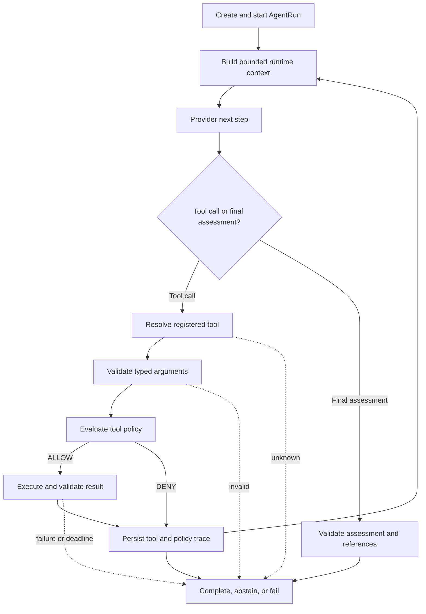

# Investigation Runtime and Tools

## Investigation Runtime

`run_candidate_investigation` in `backend/app/agent/runtime.py` coordinates one
Candidate-scoped run. The database composition in
`backend/app/infrastructure/database/candidate_agent_runtime.py` first confirms that
the Candidate exists, creates read-only `candidate:read` authorization for that
Candidate, and supplies the production tool registry.

One investigation proceeds as follows:

1. Persist the AgentRun as `CREATED`, then `RUNNING`.
2. Give the configured `InvestigationProvider` the Candidate ID, registered tool
   descriptions and schemas, earlier validated tool results, and remaining budgets.
3. Accept either one `ToolCallRequest` or a `FinalAssessmentDecision`.
4. Resolve a requested tool from the registry and validate its arguments with the
   registered Pydantic input model.
5. Evaluate Candidate scope, effect, required scopes, and risk against server-owned
   authorization.
6. If allowed, execute the registered callable and validate its result with the
   registered result model.
7. Persist the safe ToolExecution and PolicyDecisionRecord, then return the validated
   result and available references to the next provider step.
8. Validate a final `StructuredAssessment`, including every claim reference, before
   completing or abstaining.

The runtime commits durable checkpoints as it progresses. A later failure therefore
does not erase an earlier tool and policy trace.

## Runtime Flow



## Agent Tools

An Agent Tool is an explicitly registered, typed application capability. It is not a
shell, arbitrary code execution, or permission to call any function named by a model.
Every registration binds immutable metadata, an input model, a result model, and one
executor callable.

| Tool | Purpose | Access Type |
|---|---|---|
| `read_candidate_evidence` | Read the Candidate, canonical asset, hypothesis, correlation rationale, Signals, Evidence, and provenance | `READ`, low risk, `candidate:read` |
| `read_candidate_dependency_context` | Read dependency anchors and bounded dependency reachability facts | `READ`, low risk, `candidate:read` |
| `read_candidate_enterprise_context` | Read the Candidate asset, ownership, direct relationships, and direct incidents | `READ`, low risk, `candidate:read` |

These are the only tools in the production Candidate registry. Human Validation and
external action execution are not Agent Tools.

## Tool Registry

`ToolRegistry` in `backend/app/agent/registry.py` stores registrations by stable tool
ID, rejects duplicates, sorts its public listing deterministically, and fails lookup
for an unknown ID. `build_candidate_tool_registry` in
`backend/app/agent/composition.py` composes the three production registrations around
a `CandidateInvestigationReader`. Database composition occurs in
`backend/app/infrastructure/database/candidate_tool_composition.py`.

The provider receives descriptions only for those registrations. Even if a provider
returns another name, the runtime cannot resolve it to executable code.

## Tool Request Validation

Controls are applied in a fixed path:

- provider output is parsed into the discriminated `ProviderStep` contract;
- the tool ID must resolve in `ToolRegistry`;
- arguments must match the registration's strict Pydantic input schema;
- the input must be Candidate-scoped;
- policy checks Candidate identity, allowed effect, granted scopes, and maximum risk;
- the callable's output must match its registered result model; and
- only the validated, JSON-safe result enters later provider context.

Unknown and malformed requests are recorded with safe error data. Provider-supplied
arguments cannot redefine tool effect, risk, scopes, registry metadata, or server
authorization.

## Runtime Limits

`AgentRuntimeLimits` and server settings bound maximum provider iterations, tool calls,
overall run time, and per-tool time. The current configured defaults are six
iterations, three tool calls, a 60-second run budget, and a five-second tool budget;
all are positive validated settings.

These deadlines are accounting controls around synchronous calls. A slow provider or
tool is checked when control returns; the runtime does not claim to cancel work that
has already started. Budget exhaustion ends in an `ABSTAINED` run rather than a
fabricated assessment.

Controlled stop reasons are `MISSING_EVIDENCE`, `CONFLICTING_EVIDENCE`,
`POLICY_DENIED`, `BUDGET_EXHAUSTED`, `TOOL_TIMEOUT`, `TOOL_UNAVAILABLE`,
`INVALID_TOOL_ARGUMENTS`, `PROVIDER_FAILURE`, and `INTERNAL_FAILURE`.

## Failure Behavior

| Condition | Current behavior |
|---|---|
| Unknown tool | Record an `UNAVAILABLE` ToolExecution without a policy record or tool-budget charge; abstain with `TOOL_UNAVAILABLE`. |
| Invalid arguments | Record `INVALID_ARGUMENTS` before policy evaluation; abstain with `INVALID_TOOL_ARGUMENTS`. |
| Policy denial | Persist the `DENY` decision and `DENIED` ToolExecution, do not call the executor, and abstain with `POLICY_DENIED`. |
| Tool exception | Persist the allowed policy result and a safe `FAILED` ToolExecution; fail the run with `INTERNAL_FAILURE`. |
| Tool deadline exceeded | Persist `TIMED_OUT`; abstain with `TOOL_TIMEOUT` or overall `BUDGET_EXHAUSTED`. |
| Provider exception, timeout, malformed response, invalid assessment, or unavailable reference | Fail safely with `PROVIDER_FAILURE`; raw provider details are not stored. |
| Iteration, call, or overall time limit reached | Abstain with `BUDGET_EXHAUSTED` while preserving earlier audit records. |

The default deterministic provider explicitly abstains with `MISSING_EVIDENCE` when
the Evidence read is empty. The assessment contract also supports reporting
conflicting evidence; it does not manufacture a conclusion to avoid abstention.

## Adding a Tool

Use the existing extension path:

```text
Tool Contract -> Implementation -> Registration -> Policy / Validation -> Tests
```

Keep the capability narrow, declare truthful effect, risk, and scopes, and compose it
explicitly. See [Extending the System](../06-api-frontend-and-development/extending-the-system.md)
for the broader development workflow.

## Related Documentation

- [Agent Overview](agent-overview.md)
- [Provider and Grounding](provider-and-grounding.md)
- [Policy, Actions, Execution and Audit](policy-actions-execution-and-audit.md)
- [Extension Architecture](../02-architecture/extension-architecture.md)
