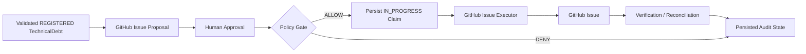

# Policy, Actions, Execution and Audit

An AI recommendation does not become an external mutation. The Current PoC Baseline
uses separate persisted stages for intent, human consent, deterministic
authorization, external execution, and confirmation.

## Governed Action Model

```text
TechnicalDebt
  -> ActionProposal
  -> Human Approval
  -> Policy Decision
  -> ActionExecution
  -> ActionVerification / Reconciliation
  -> Auditable persisted history
```

- **TechnicalDebt** supplies the governed source identity and Candidate context.
- **ActionProposal** is an immutable preview of one exact mutation.
- **Human Approval** accepts that proposal's exact fingerprint.
- **Policy Decision** independently allows or denies an execution attempt.
- **Executor** performs the approved and allowed external write.
- **Verification** reads the external system and compares the result with the
  proposal.
- **Audit state** preserves each stage as explicit records rather than collapsing the
  flow into one status.

## Action Proposal

The only current action type is `CREATE_GITHUB_ISSUE`. A user triggers preparation for
a `REGISTERED` TechnicalDebt record; the server then composes the proposal from the
persisted TechnicalDebt and source Candidate plus a server-owned target repository
and preparer identity. Client input contains only the TechnicalDebt identity.

The proposal stores its ID, TechnicalDebt ID, action type, repository owner and name,
exact title and body, SHA-256 payload fingerprint, reconciliation marker,
`prepared_by`, and creation time. The marker is embedded in the final body before the
fingerprint is calculated. Preparation persists a preview and performs no GitHub
write.

An agent's free-text recommendation remains advisory. The agent does not create an
ActionProposal, select its target, approve it, or invoke execution. **Proposal does
not equal permission.**

## Human Approval

`ActionApproval` records that a server-attributed human approved one exact persisted
proposal fingerprint. The approval command cannot replace the repository, title,
body, action type, actor, or policy result. A stale fingerprint is rejected, as are a
second approval for the same proposal and a competing approved proposal for the same
logical GitHub Issue action.

**Human Approval is not Policy Authorization.** Approval records consent to the
preview. It neither enables execution nor proves that the target, action type,
executor, and current server configuration are permitted.

## Policy Gate

Immediately before creating an execution claim, `evaluate_action_execution_policy`
checks trusted inputs in this fixed order:

1. external execution is enabled and an executor is configured;
2. the action type is `CREATE_GITHUB_ISSUE`;
3. the proposal target exactly matches the server-owned allowlisted repository;
4. an approval exists; and
5. the approval fingerprint equals the proposal fingerprint.

The result is `ALLOW` with `POLICY_ALLOWED`, or `DENY` with
`EXECUTION_DISABLED`, `ACTION_TYPE_NOT_ALLOWED`, `REPOSITORY_NOT_ALLOWLISTED`,
`APPROVAL_MISSING`, or `FINGERPRINT_MISMATCH`. Each evaluation reached by a new
execution request is appended as an `ActionPolicyDecision` with its proposal,
optional approval, rule, reason, and timestamp. A denial creates no execution and the
API returns a forbidden response.

Policy does not authenticate a person, approve the business decision, execute
GitHub, verify an Issue, or change TechnicalDebt lifecycle state.

## Executor Boundary

An Executor is the action-plane component permitted to perform one specific,
authorized external mutation. The current `GitHubIssueExecutor` protocol accepts the
already-approved owner, repository, title, and body and returns a bounded outcome.

```text
Connector = read boundary
Executor  = controlled write boundary
```

The read-only GitHub Issues Connector is not used to create Issues. The executor is
also separate from the agent, human approval, and policy: the agent has no write
tool, approval does not authorize, policy does not perform I/O, and the executor does
not decide whether it should be called.

## Current GitHub Execution



After policy allows, the service persists an `IN_PROGRESS` ActionExecution and commits
it before network I/O. It calls `HttpGitHubIssueExecutor` outside the database
transaction. That adapter sends one GitHub Issue request with explicit timeouts and
zero automatic retries.

The safe execution outcome becomes:

- `SUCCEEDED` with the external Issue ID, number, and URL;
- `FAILED` with `EXTERNAL_REJECTED` or `NOT_SENT`; or
- `UNKNOWN` with `TRANSPORT_UNKNOWN` when the side effect may have occurred but the
  response is not trustworthy.

External writes and credentials are disabled or absent by default and are selected
only through server configuration.

## Verification and Reconciliation

An execution request means the system attempted an action. Verification means a
separate read observed and matched the expected external state. Reconciliation means
the stored execution state is aligned with an external side effect after an uncertain
or interrupted execution.

For `SUCCEEDED`, the dedicated GET-only `GitHubIssueVerifier` reads the recorded Issue
and checks that:

- the repository path, Issue number, and stored external reference agree;
- the observation is an Issue, not a pull request;
- the reconciliation marker is present;
- the title exactly matches; and
- a fingerprint recomputed from the observed title and body matches the proposal.

The persisted verification result is `PASS`, `FAIL`, or `UNAVAILABLE`, with an
observed Issue reference when applicable and a safe reason code for mismatch or
transport unavailability.

For `UNKNOWN` or a crash-window `IN_PROGRESS` record, the verifier searches by the
unique marker. Exactly one usable matching Issue can promote the execution to
`SUCCEEDED` and then be compared. No match or multiple matches remain unresolved;
the system does not issue another write. A definitely `FAILED` execution is not
verifiable.

An ActionExecution marked `SUCCEEDED` is therefore successful execution, not verified
execution. Only a separate `PASS` records confirmation, and even `PASS` does not close
the `REGISTERED` TechnicalDebt.

## Audit Trail

Auditability is implemented through explicit domain records, not a generic audit-log
table. The persisted and API-visible chain includes:

| Stage | Persisted trace |
|---|---|
| Registration | TechnicalDebt ID, source Candidate, creating HumanDecision, status, time |
| Proposal | Exact target and payload, fingerprint, marker, preparer, time |
| Approval | Proposal and fingerprint, actor reference, time |
| Policy | Proposal, optional approval, `ALLOW`/`DENY`, rule, reason, time |
| Execution | Proposal, debt, authorizing policy decision, status, safe outcome, times, optional external reference |
| Verification | Execution, `PASS`/`FAIL`/`UNAVAILABLE`, safe reason, time, optional observed reference |

The TechnicalDebt detail API returns these collections, and the Nuxt workbench keeps
prepare, approve, execute, and verify as separate actions. Its audit timeline orders
registration, proposal, approval, policy, execution, and verification records while
preserving their ID relationships.

## Failure Scenarios

| Scenario | Current safeguard |
|---|---|
| Action not approved | Policy persists `DENY` / `APPROVAL_MISSING`; the executor is not called. |
| Policy denial | No ActionExecution is created and no external write occurs. |
| Definite executor failure | Persist `FAILED` with a safe category and no external Issue claim. |
| External outcome uncertain | Persist `UNKNOWN`; do not retry the write; use marker-based reconciliation. |
| External state cannot be read | Persist `UNAVAILABLE` when a verification outcome can be recorded, without claiming success. |
| External state differs | Persist `FAIL` with a bounded mismatch reason. |
| Uncertain result has zero or multiple marker matches | Leave reconciliation unresolved and create no false verification record. |
| Same proposal is executed again | Return the existing execution and do not post again. |
| Another proposal competes with a live execution | Reject the conflicting logical execution. |

## Current Boundary

GitHub Issue creation is the only implemented external execution path. The PoC does
not include Jira or Azure DevOps executors, enterprise RBAC, separation-of-duty
enforcement, centralized audit export, automatic remediation, or a lifecycle
transition after verification.

## Related Documentation

- [Human Validation and Technical Debt Lifecycle](human-validation-and-lifecycle.md)
- [Investigation Runtime and Tools](investigation-runtime-and-tools.md)
- [Security and Trust Boundaries](../02-architecture/security-and-trust-boundaries.md)
- [Connector Architecture](../04-signals-context-and-integrations/connector-architecture.md)
- [Production Readiness](../07-handover-and-roadmap/production-readiness.md)
