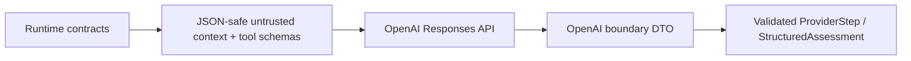

# Provider and Grounding

## Provider Boundary

Provider-specific request and response formats are isolated so the investigation
runtime does not depend on one model vendor. The application-owned
`InvestigationProvider` protocol in `backend/app/agent/runtime_contracts.py` exposes
one operation: given an `InvestigationRuntimeContext`, return the next bounded
`ProviderStep`.

The main pieces are:

| Concern | Current code |
|---|---|
| Provider contract and runtime DTOs | `backend/app/agent/runtime_contracts.py` |
| Default provider | `backend/app/agent/deterministic_provider.py` |
| OpenAI adapter and boundary DTOs | `backend/app/agent/openai_provider.py` |
| Server-side provider selection | `backend/app/agent/provider_composition.py` |
| Application-facing assessment and references | `backend/app/agent/audit_contracts.py` |

Provider selection, model name, credential, and timeouts come from validated server
settings. A client starting an investigation sends no prompt, model, provider, tool,
or authority configuration.

## Current Provider

`DeterministicCandidateInvestigationProvider` is the default. It requests the three
production read tools in a fixed order and produces either a grounded assessment or a
missing-evidence abstention without live model inference.

`OpenAIProvider` is the opt-in reference AI provider. It uses the OpenAI Responses API
with the registry's strict function definitions, disables parallel tool calls and
response storage, requests a typed assessment, and performs no SDK retries. Live use
requires explicit server-side API key and model configuration. The presence of this
adapter does not imply that other providers are implemented.

## Provider-Boundary Serialization

Internal runtime and domain objects are not passed directly to the external provider.
The OpenAI adapter creates a provider-safe boundary representation:

The context string contains the Candidate ID, remaining budgets, and earlier tool
results serialized with Pydantic's JSON mode. Tool definitions are built separately
from registered descriptors and input schemas. Investigation content is explicitly
marked as untrusted data rather than instructions or authorization.

On return, the adapter accepts exactly one function call or one parsed assessment. It
parses function arguments as a JSON object and maps the provider assessment DTO into
the application's canonical reference and assessment models. This keeps SDK objects,
provider response shapes, and provider-specific schema accommodations out of the
runtime and domain contracts.

## Structured Output

The OpenAI boundary uses `OpenAIStructuredAssessment`, a strict Pydantic model with
extra fields forbidden. It is converted into `StructuredAssessment`, whose invariants
require:

- a grounded conclusion for `SUPPORTED`;
- no conclusion and a meaningful reason for `ABSTAINED`; and
- nonblank claims with at least one typed reference.

The runtime performs a second, essential check: every Evidence or ToolExecution ID
cited by a claim must have been made available in that run's validated tool
observations. An invalid, ambiguous, refused, or ungrounded provider response becomes
a safe provider failure. Raw provider output and hidden reasoning are not persisted.

## Grounding

Grounding connects an assessment claim to information that the governed runtime
actually obtained. It prevents a fluent statement from being presented as supported
merely because a provider generated it.

The current system grounds claims in persisted Candidate Evidence and in the trace of
validated tool results. Context remains bounded to the Candidate authorized for the
run. Grounding supports review; it does not validate the Candidate or prove the
claim's ultimate correctness.

## Grounding References

`AssessmentReference` supports exactly two reference types:

| Reference | Meaning | How it is surfaced |
|---|---|---|
| `EVIDENCE` | A persisted Evidence ID returned by `read_candidate_evidence` | The API returns the ID; the Nuxt view reuses the Candidate Evidence source reference and provenance when that ID is present on the page. |
| `TOOL_EXECUTION` | A ToolExecution ID from the current investigation | The API and UI link the claim to the recorded tool, status, sequence, and safe trace. |

Dependency and enterprise-context claims are therefore grounded through their
ToolExecution records; there are no separate grounding-reference categories for
incidents, dependencies, architecture documents, or arbitrary URLs. The UI does not
invent a description for an Evidence ID it cannot resolve.

## Grounding vs Ground Truth

**Grounding Reference** is information made available to support a runtime
assessment.

**Evaluation Ground Truth** is an independent expected result used to measure system
behavior.

They are not interchangeable. Evaluation expectations live under
`evaluation/ground_truth/`, outside the runtime. Tests verify that application
modules, migrations, and seed logic do not import, load, or persist that material.
The agent must not receive evaluation ground truth as investigation input.

## Provider Replacement

Another provider can implement `InvestigationProvider` and be added to the
server-owned composition path. It must preserve the same bounded steps, registered
tool surface, strict serialization, safe failures, structured assessment, reference
validation, and timeout behavior. No local-model or additional vendor adapter is part
of the Current PoC Baseline.

## Current PoC Boundary

The provider abstraction and OpenAI adapter are production-aware boundaries, not a
complete provider platform. The PoC has no provider registry, model routing,
cross-provider fallback, streaming investigation, or centralized model telemetry.
Live OpenAI testing is explicitly opt-in.

## Related Documentation

- [Agent Overview](agent-overview.md)
- [Investigation Runtime and Tools](investigation-runtime-and-tools.md)
- [Extension Architecture](../02-architecture/extension-architecture.md)
- [Data Lifecycle](../03-data-and-database/data-lifecycle.md)
