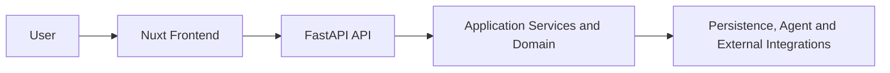

# API and Frontend Overview

## Purpose

The Nuxt frontend provides the governance workspace used to inspect sources, review
Candidates, run investigations, record human decisions, and manage governed external
actions. The FastAPI backend owns domain behavior, persistence, agent orchestration,
governance transitions, policy checks, and external execution.

The frontend is not a source of business truth. It presents backend state and submits
user intent; the backend decides whether that intent is valid and authorized.

## High-Level Interaction



## API Role

All implemented application routes are under `/api/v1`. Route composition is in
`backend/app/api/v1/router.py`; request and response contracts are Pydantic models in
`backend/app/api/v1/*_schemas.py`.

| API Area | Purpose |
|---|---|
| Health | Return the application health response from `GET /api/v1/health`. This is not a database or integration health check. |
| Connectors | List registered read connectors and their metadata. Registration does not mean that acquisition ran or succeeded. |
| Candidates | List Candidate summaries and load Candidate detail, including Signals, Evidence, enterprise context, dependency context, and governance history. |
| Agent investigation | Start a Candidate-scoped investigation and retrieve a specific AgentRun with its structured assessment, tool trace, and tool-policy decisions. |
| Human validation | Record `VALIDATE`, `REJECT`, or `REQUEST_INFO` against the current governance revision using server-owned actor attribution. |
| Technical debt | List and load `REGISTERED` TechnicalDebt records with their source Candidate, creating decision, and action history. |
| Governed actions | Prepare a GitHub Issue proposal, approve its exact fingerprint, request policy-controlled execution, and request external verification or reconciliation. |

The route modules are `backend/app/api/v1/candidates.py`, `agent_runs.py`,
`human_decisions.py`, `technical_debts.py`, and `connectors.py`. They translate HTTP
input and errors but do not redefine domain meaning.

## Frontend Role

Implemented Nuxt pages under `frontend/app/pages/` are:

| Screen | Responsibility |
|---|---|
| `/overview` | Summarize the current Candidate collection and link to the implemented workspaces. |
| `/sources` | Show registered Connector metadata and explain the implemented ingestion paths. |
| `/candidates` | Display the Candidate review queue with client-side text and asset-type filters. |
| `/candidates/{id}` | Present Overview, Evidence & Context, AI Investigation, and Human Validation tabs. |
| `/technical-debts` | Display the portfolio of records created by human validation. |
| `/technical-debts/{id}` | Show source and decision context plus proposal, approval, execution, verification, and audit controls. |

Major workflow components live under `frontend/app/components/candidate/` and
`frontend/app/components/technicalDebt/`. The UI exposes the separate governance
stages; it does not combine an AI recommendation with a human decision or treat an
approval as policy authorization.

## Backend-Frontend Contract

Composables in `frontend/app/composables/` call the FastAPI routes using wire types
from `frontend/app/types/*Api.ts`. Utilities such as
`frontend/app/utils/mapCandidateDetail.ts`, `mapAgentRun.ts`, and
`mapTechnicalDebt.ts` convert snake_case API data into presentation-oriented values.

These mappings may format labels, order records, and associate visible Evidence or
ToolExecution references. They do not calculate Candidate correlation, authorize a
tool, validate a Candidate, create TechnicalDebt, evaluate action policy, or verify
an external result. A display label or client-side enabled button never overrides
the backend contract.

Keep these boundaries explicit:

```text
Frontend presentation     != business authority
API response contract     != domain model
AI recommendation         != human decision
Human approval            != policy authorization
Execution request         != verified result
```

## Error and Empty States

- Candidate and TechnicalDebt lists show loading, request-error, and empty states.
- Candidate and TechnicalDebt detail pages distinguish a missing record (`404`), an
  invalid UUID (`422`), loading, and a general request failure.
- Investigation start failures are shown without turning them into Candidate
  rejection; completed, abstained, and failed AgentRuns remain distinct.
- Human-validation conflicts refresh the latest governance projection when possible;
  disabled validation is reported as unavailable.
- Action preparation reports missing server configuration. Approval or execution
  denial is not displayed as success.
- An uncertain execution instructs the user not to repeat the write. Verification
  reports `PASS`, `FAIL`, or `UNAVAILABLE`, and unresolved reconciliation remains a
  conflict rather than a verified result.

## Related Documentation

- [User Flow](user-flow.md)
- [Repository Structure](repository-structure.md)
- [System Architecture](../02-architecture/system-architecture.md)
- [Human Validation and Technical Debt Lifecycle](../05-agent-and-governance/human-validation-and-lifecycle.md)
