# User Flow

## Main Governance Journey

The implemented workflow starts with persisted Candidates. Agent investigation is
available to assist review but is not required by the Human Validation command.

```mermaid
flowchart LR
    Pool[Candidate Pool]
    Detail[Candidate Detail]
    Evidence[Evidence and Context]
    Agent[Agent Investigation]
    Human[Human Validation]
    Debt[Technical Debt]
    Proposal[Governed Action Proposal]
    Approval[Human Approval]
    Policy[Policy Decision]
    Execution[Execution]
    Verification[Verification]

    Pool --> Detail --> Evidence --> Human
    Evidence -. optional investigation .-> Agent --> Human
    Human -->|VALIDATE| Debt --> Proposal --> Approval --> Policy --> Execution --> Verification
```

`REJECT` ends the current Candidate review lifecycle. `REQUEST_INFO` keeps the
Candidate open in `INFORMATION_REQUESTED`; it does not create TechnicalDebt.

## Step-by-Step User Flow

### Candidate Pool

The `/candidates` page loads `GET /api/v1/candidates` and shows each Candidate's
human-readable problem title, affected asset, asset type, Signal count, and Evidence
count. The user can search by Candidate title or asset name and filter by asset type.
Filtering is client-side over the returned collection; it does not change backend
state or imply priority.

### Candidate Detail

Opening a Candidate loads `GET /api/v1/candidates/{candidate_id}`. The workspace has
four tabs:

- **Overview** shows the hypothesis, correlation rationale, counts, enterprise asset
  snapshot, ownership, and dependency summary.
- **Evidence & Context** shows Evidence, Signals, source identity and provenance,
  recorded ownership and relationships, direct incidents, and dependency
  reachability.
- **AI Investigation** starts and presents an AgentRun.
- **Human Validation** presents the current governance state, valid decisions, and
  decision history.

Enterprise criticality, relationships, incidents, and dependency reachability are
context. The UI does not present them as proof of impact, causality, or debt.

### Agent Investigation

The user starts an investigation from the Candidate detail workspace. The frontend
sends a bodyless `POST` to the Candidate's `agent-runs` collection; provider, model,
tools, authorization, and limits remain server-owned.

The returned view can show a supported assessment or abstention, conclusion,
supporting claims, Evidence and ToolExecution grounding references, missing evidence,
uncertainties, a recommended next step, tool activity, and tool-policy decisions.
The user may start another run. The current page does not automatically load a prior
AgentRun on entry.

### Human Validation

For `PENDING` and `INFORMATION_REQUESTED` Candidates, the UI offers exactly:

- `VALIDATE`, with a required rationale;
- `REJECT`, with a required rationale; and
- `REQUEST_INFO`, with required requested-information text.

The request includes the current governance revision but not an actor identity.
After a successful submission, the page refreshes its backend projection. `VALIDATE`
atomically creates a separate `REGISTERED` TechnicalDebt record and exposes a link to
it. `REJECT` is terminal, while `REQUEST_INFO` permits another review decision.

### Technical Debt

The `/technical-debts` page lists records created by `VALIDATE`. The detail page shows
the record's `REGISTERED` status, source Candidate, creating Human Decision, and
persisted governed-action history. The current UI does not invent priority, effort,
risk score, target date, or closure status.

### Governed Action

The implemented external action is GitHub Issue creation:

1. **Proposal:** the user requests a server-composed immutable preview. Preparation
   performs no external write.
2. **Approval:** a server-attributed human approves the proposal's exact payload
   fingerprint.
3. **Policy:** execution re-evaluates trusted configuration, action type, target,
   approval, and fingerprint. A denial creates no execution.
4. **Execution:** an allowed request may create a real GitHub Issue through the
   dedicated executor. The outcome is `SUCCEEDED`, `FAILED`, or `UNKNOWN`.
5. **Verification:** a separate read-back records `PASS`, `FAIL`, or `UNAVAILABLE`.
   Uncertain executions use reconciliation and must not be retried as new writes.

The detail page shows the external reference when one has been persisted and builds
an audit timeline from the registration, proposal, approval, policy, execution, and
verification records. Verification does not change the TechnicalDebt status from
`REGISTERED`.

## UI vs Governance Authority

The frontend provides interaction and visibility. The backend remains authoritative
for lifecycle transitions, actor attribution, proposal content, approval integrity,
policy decisions, execution targets, credentials, external writes, and verification.

## Related Documentation

- [API and Frontend Overview](api-and-frontend-overview.md)
- [End-to-End Flow](../01-overview/end-to-end-flow.md)
- [Policy, Actions, Execution and Audit](../05-agent-and-governance/policy-actions-execution-and-audit.md)
