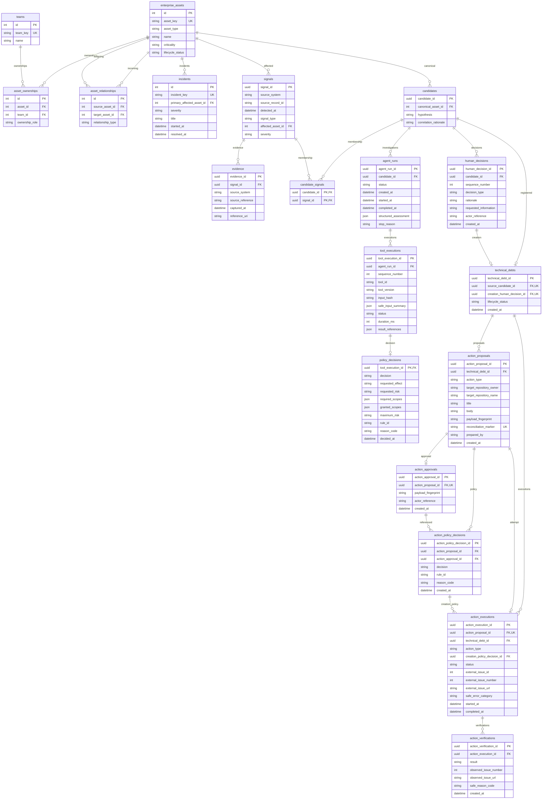

# Database evolution and migrations

Handover-ready notes for the current MSSQL / SQLAlchemy 2 / Alembic stack.
This is not an enterprise DBA manual.

Do not copy real credentials into this document. Safe placeholders only.

## Current technology

| Piece | Current choice |
| --- | --- |
| Database | MSSQL |
| ORM | SQLAlchemy 2, synchronous application database layer |
| Migrations | Alembic |
| Dialect | `mssql+pyodbc` |

FastAPI routers do not execute SQL directly. Persistence lives under
`backend/app/infrastructure/database`. Alembic configuration lives in
`backend/alembic.ini` and `backend/alembic/env.py`. Revisions live in
`backend/alembic/versions`.

`DATABASE_URL` is backend-only. It is not a Nuxt `runtimeConfig` value.

## Schema-as-code relationship

These artifacts are related but distinct:

| Artifact | Role |
| --- | --- |
| Domain models | canonical business meaning |
| SQLAlchemy ORM models | desired application mappings / metadata |
| Alembic revisions | migration history and DDL transitions |
| MSSQL runtime database + `alembic_version` | deployed state |
| Tests | verification evidence |

**ORM != Alembic != live DB.** They are not interchangeable. A model class,
a revision file, and a deployed database can drift. `alembic_version` records
the applied revision; it is Alembic bookkeeping, not an application-domain
table.

Human Validation writes are owned by `apply_human_validation`. That service
requires a transaction-free Session and performs BEGIN, Candidate-row lock,
read, validate, write, and COMMIT or ROLLBACK. Persistence helpers
`persist_human_decision` and `persist_technical_debt` flush; they do not
commit. This is distinct from AgentRun audit checkpoint commits.

Governed action services likewise own their transactions. Execution and
verification never hold a database transaction across external HTTP. Persistence
helpers for ActionProposal, ActionApproval, ActionPolicyDecision,
ActionExecution, and ActionVerification flush; they do not commit. Secrets are
not persisted on those tables.

## Current schema inventory

Application tables:

- `enterprise_assets`
- `teams`
- `asset_ownerships`
- `asset_relationships`
- `incidents`
- `signals`
- `evidence`
- `candidates`
- `candidate_signals`
- `agent_runs`
- `tool_executions`
- `policy_decisions`
- `human_decisions`
- `technical_debts`
- `action_proposals`
- `action_approvals`
- `action_policy_decisions`
- `action_executions`
- `action_verifications`

Also present at runtime after Alembic has run:

- `alembic_version` — Alembic bookkeeping only

There are **no** `connector`, `connector_health`, `connector_run`, or
`checkpoint` tables. Candidates have **no** status or revision columns.

## DAY 2 PACKAGES 2–4: NO SCHEMA CHANGE

This was deliberate.

| Day 2 surface | Persistence |
| --- | --- |
| Connector contract | code only |
| GitHub connector | code/config only |
| Connector Registry API | code only |
| Sources & Connectors UI | frontend/API visibility only |

No connector persistence was added. Registry inventory remains in code.
Do not create connector tables merely because a connector exists.

## Current ERD

Relationships below are the current ORM relationships only. No invented
edges.



Notes that match the ORM:

- `asset_ownerships` joins `enterprise_assets` and `teams`.
- `asset_relationships` is a directed edge between two enterprise assets.
- `incidents` reference one primary affected asset.
- `signals` reference one affected enterprise asset.
- `evidence` belongs to a signal.
- `candidates` reference one canonical enterprise asset.
- `candidate_signals` is the Candidate–Signal membership table.
- Candidates do not own Evidence rows directly; Evidence remains on Signal.
- AgentRuns belong to a Candidate and store an optional validated Structured
  Assessment JSON document.
- ToolExecutions are ordered audit records within one AgentRun. Their input
  summary is limited to allowlisted Candidate identity and paired with a
  canonical SHA-256 hash; raw tool payloads are not stored.
- A ToolExecution has at most one PolicyDecision, keyed by the ToolExecution
  identifier. Policy facts record registry metadata and trusted authorization
  context without duplicating the AgentRun identifier.
- HumanDecisions are append-only history for one Candidate. Sequence numbers
  are unique per Candidate (`uq_human_decisions_candidate_sequence`).
- TechnicalDebt references its source Candidate and the creating VALIDATE
  HumanDecision. `source_candidate_id` and `creation_human_decision_id` are
  each unique. Current `lifecycle_status` is only `REGISTERED`.
- Candidates were not given status or revision columns. Governance state and
  revision are derived from HumanDecision history.
- ActionProposals are append-only immutable previews. Multiple rows per
  TechnicalDebt are allowed. `reconciliation_marker` is unique.
  `action_type` is currently only `CREATE_GITHUB_ISSUE`.
- ActionApprovals are append-only. One approval per ActionProposal
  (`uq_action_approvals_action_proposal_id`). Competing CREATE occupancy is
  enforced in application code and excludes approvals whose execution is
  `FAILED`.
- ActionPolicyDecisions are append-only. ALLOW requires a non-null
  `action_approval_id`. Reason codes are constrained in-table.
- ActionExecutions are one row per ActionProposal
  (`uq_action_executions_action_proposal_id`). Live logical occupancy uses a
  filtered unique index `uq_action_executions_live_logical_action` on
  `(technical_debt_id, action_type)` where status is `IN_PROGRESS`,
  `SUCCEEDED`, or `UNKNOWN`. `FAILED` is excluded, so a later proposal may
  occupy the slot. This is MSSQL filtered-index semantics via Alembic
  `mssql_where` (SQLite tests use `sqlite_where`). It is not PostgreSQL.
- ActionVerifications are append-only. Multiple verifications per execution
  are allowed. Raw GitHub responses and secrets are not stored.

## Migration history

Exact current chain, single head, no branching:

```text
20260826_01 → 20260827_01 → 20260828_01 → 20260831_01 → 20260905_01
  → 20260906_01 → 20260907_01 → 20260907_02 → 20260907_03 → 20260907_04
```

Current head: **`20260907_04`**.

| Revision | Purpose |
| --- | --- |
| `20260826_01` | baseline, no schema change |
| `20260827_01` | enterprise estate foundation |
| `20260828_01` | signals + evidence |
| `20260831_01` | candidates + `candidate_signals` |
| `20260905_01` | AgentRun, ToolExecution, and PolicyDecision audit persistence |
| `20260906_01` | HumanDecision history and REGISTERED TechnicalDebt |
| `20260907_01` | immutable ActionProposal persistence |
| `20260907_02` | append-only ActionApproval and ActionPolicyDecision |
| `20260907_03` | ActionExecution plus filtered live logical uniqueness |
| `20260907_04` | append-only ActionVerification |

This inventory describes repository revisions. It does not assert the applied
revision of any live database until that database is inspected.

## Schema vs data

| Mechanism | Role |
| --- | --- |
| Alembic revisions | schema migration |
| `seed_enterprise_estate` / `SYNTHETIC_*` | synthetic seed/reference estate |
| `development_population.py` | development/demo population |
| `synthetic_sources` | controlled source input |
| `synthetic_repositories` | controlled scanner input |
| `evaluation/ground_truth` | evaluation fixture only |

Ground truth must remain isolated from runtime behavior. Do not perform
production backfills via demo seed logic.

## Future data migrations

If a real production data migration or backfill becomes necessary, use an
explicit reviewed data-migration strategy. Possible forms:

- an Alembic data migration
- a dedicated reviewed one-off migration

Do **not** hide production data migration inside:

- `seed_enterprise_estate`
- `development_population`
- evaluation fixtures

## Compatibility: CURRENT vs FUTURE PRACTICE

**CURRENT**

- migrations create tables
- no expand/migrate/contract workflow exists
- no destructive column migrations exist

**FUTURE PRACTICE**

Prefer additive, backward-compatible evolution. For larger changes:

```text
expand → migrate → contract
```

That sequence is guidance only. It is not implemented as a current workflow.

## Rollback / roll-forward

Actual downgrade functions:

| Revision | Downgrade |
| --- | --- |
| `20260826_01` | no-op |
| later migrations | drop the tables they created |

This is useful for disposable/dev databases. It may be destructive when data
exists.

Guidance:

- **Development:** downgrade may be acceptable for disposable data.
- **Production-aware recovery:** prefer roll-forward for irreversible or
  data-bearing failures.

Do not always downgrade. Full production rollback automation does not exist.

## Migration verification coverage

Statuses below are honest against currently inspected evidence, including Day 4
Package 3 MSSQL governance proof and Day 5 package-stage MSSQL action tests.
This documentation package did not re-run live MSSQL.

| Claim | Status | Evidence |
| --- | --- | --- |
| Single head | **PROVEN** | Alembic script directory; `20260907_04` is the only head; predecessor is `20260907_03` |
| Clean DB → head | **PARTIALLY PROVEN** | live MSSQL upgrade-to-head exists in later integration tests; a guaranteed empty-database bootstrap is not a dedicated proven path |
| Existing DB → head | **PARTIALLY PROVEN** | configured MSSQL upgrade-to-head exists in Day 4/Day 5 integration tests; starting revision is not always separately captured |
| Live downgrade | **NOT PROVEN** | downgrade SQL is compiled in-process (`as_sql`); no live MSSQL downgrade test was found |
| Upgrade after downgrade | **NOT PROVEN** | no round-trip test exists |
| ORM/schema correspondence | **PARTIALLY PROVEN** | ORM metadata, Alembic `env.py` imports, compiled MSSQL CREATE TABLE SQL, and live table/FK/uniqueness inspection are checked; complete live column/constraint parity is not proven |
| Actual MSSQL migration | **PROVEN for Day 3–5 tables in package-stage integration tests** | Day 4 governance tests plus Day 5 `test_mssql_action_proposal_persistence.py`, `test_mssql_action_approval_persistence.py`, `test_mssql_action_execution_persistence.py`, and `test_mssql_action_verification_persistence.py` inspect schema through `20260907_04` |
| Same-Candidate MSSQL concurrency | **PROVEN for concurrent same-revision VALIDATE** | `test_mssql_serializes_same_revision_commands_and_creates_one_technical_debt` used `UPDLOCK`/`HOLDLOCK`; one winner, one stale conflict, one decision #1, exactly one TechnicalDebt. SQLite does not prove this |
| Live logical action uniqueness | **PROVEN in Day 5 MSSQL execution tests** | filtered unique index on `(technical_debt_id, action_type)` for `IN_PROGRESS` / `SUCCEEDED` / `UNKNOWN`; concurrent same-proposal POST once; concurrent different proposals one winner |
| UNKNOWN reconciliation | **PROVEN in Day 5 MSSQL verification tests** | concurrent UNKNOWN reconcile remains safe; verifier is GET-only |

Do not improve these claims without adding or running new proof. These MSSQL
tests use fake executors/verifiers. They do not perform a real GitHub write.

## Safe MSSQL configuration

Use placeholders only. Example:

```text
DATABASE_URL=mssql+pyodbc:///?odbc_connect=<url-encoded-odbc-connection-string>
```

`DATABASE_URL` is backend-only. Put real values in an untracked `.env` or
process environment. Commit `backend/.env.example` only.

SQL authentication examples in `.env.example` are placeholders (`username`,
`password`, local instance names). Do not copy a real `.env`.

Integration tests that need MSSQL are marked `integration` and are excluded
from the deterministic suite:

```text
python -m pytest -m "not integration and not external"
```
